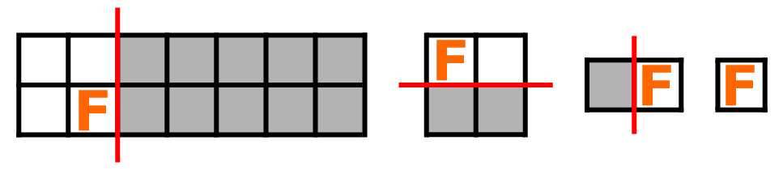
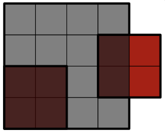

### [好的开始（Good Start）](https://codeforces.com/contest/2113/problem/B)

**时间限制：** 1 s
**内存限制：** 256 MB

**输入：** 标准输入
**输出：** 标准输出


屋顶是一个大小为 $w \times h$ 的矩形，其左下角位于平面上的点 $(0$，$0)$。你的团队需要用一些完全相同的屋顶瓦片来完全覆盖这个屋顶，瓦片的尺寸为 $a \times b$。要求如下：

- 瓦片 **不能旋转**（即使是旋转 $90^\circ$ 也不行）。
- 瓦片之间 **不能重叠**（但它们可以在边缘处接触）。
- 瓦片 **可以超出** 屋顶矩形的边界。

你们团队中的一个新手已经在屋顶上放置了 **两块** 这样的瓦片，**它们没有重叠**，而且 **每块都至少部分覆盖了屋顶**。

你的任务是判断是否可以在 **不移除这两块瓦片的前提下**，继续放置瓦片，**使整个屋顶被完全覆盖**。


### 输入

每个测试包含多个测试用例。
 第一行是一个整数 $t$（$1 \le t \le 10^4$），表示测试用例的数量。

接下来每个测试用例包括两行：

- 第一行是四个整数 $w$、$h$、$a$ 和 $b$（$1 \le w$，$h$，$a$，$b \le 10^9$），表示屋顶的宽度和高度，以及瓦片的宽度和高度。
- 第二行是四个整数 $x_1$、$y_1$、$x_2$ 和 $y_2$（$-a + 1 \le x_1$，$x_2 \le w - 1$，$-b + 1 \le y_1$，$y_2 \le h - 1$），表示已放置的两块瓦片左下角的坐标。保证这两块瓦片不重叠。


### 输出

对于每个测试用例，如果可以在不移除已放置瓦片的情况下完全覆盖屋顶，输出 $Yes$；否则输出 $No$。

你可以使用任意大小写的形式，如 $yEs$，$yes$，$Yes$ 和 $YES$ 都是可以识别的。


### 样例

**样例输入：**

```cpp
7
6 5 2 3
-1 -2 5 4
4 4 2 2
0 0 3 1
10 9 3 2
0 0 4 3
10 9 3 2
0 0 6 3
5 5 2 2
-1 -1 4 -1
5 5 2 2
-1 -1 2 3
7 8 2 4
0 0 0 5
```


**样例输出：**

```cpp
Yes
No
No
Yes
No
Yes
No
```


### 注意
在第一个示例中，可以再添加 8 块瓦片，使得整个屋顶被完全覆盖。

在第二个示例中，无法做到完全覆盖。

<div style="display: flex; align-items: center;">
  
  
</div> 


### 题解

要使整个屋顶能在不移除这两块瓦片的前提下完全铺满，当且仅当满足以下条件之一：

- $(x_2 - x_1) \bmod a = 0$，即两块瓦片在水平方向上间隔是 $a$ 的倍数，可以沿列铺设；
- $(y_2 - y_1) \bmod b = 0$，即在竖直方向上的间隔是 $b$ 的倍数，可以沿行铺设。

换句话说，只要这两块瓦片在某个方向上是对齐的（间隔正好可被瓦片尺寸整除），就可以继续以相同方式延展，直到完全覆盖屋顶。

如果 $x_1 = x_2$，说明它们在同列，只能沿列铺设；
如果 $y_1 = y_2$，说明它们在同行，只能沿行铺设（这是上述条件的特殊情况）。

最终判断条件为：
$$
(x_1 \ne x_2 \text{ 且 } (x_2 - x_1) \bmod a = 0) \quad \text{或} \quad (y_1 \ne y_2 \text{ 且 } (y_2 - y_1) \bmod b = 0)
$$
若满足上述条件，则可以继续铺设瓦片完全覆盖屋顶；否则无法完成覆盖。


```cpp
void solve()
{
	int w, h, a, b, x1, y1, x2, y2;
	cin >> w >> h >> a >> b >> x1 >> y1 >> x2 >> y2;

	w = max(x1, x2) - min(x1, x2);
	h = max(y1, y2) - min(y1, y2);
	if (w > 0 && !(w % a) || h > 0 && !(h % b))
		cout << "YES" << endl;
	else
		cout << "NO" << endl;
}
```