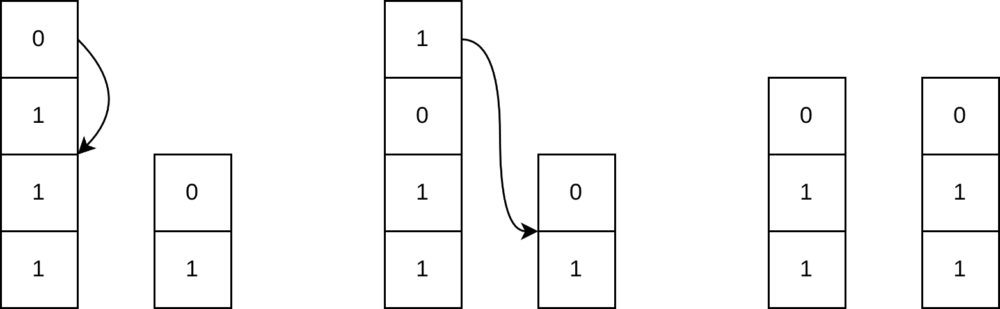
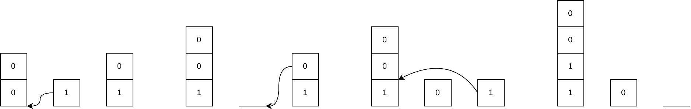

### [堆叠洗牌（Pile Shuffling）](https://codeforces.com/contest/2122/problem/B)

**时间限制：** 1 s
**内存限制：** 256 MB

**输入：** 标准输入
**输出：** 标准输出


你有 $n$ 个二进制牌堆，第 $i$ 个牌堆的初始状态是：上面有 $a_i$ 个 0，下面有 $b_i$ 个 1。

一次操作中，你可以从任意一个牌堆**取出最上面的一张牌**，然后把它放到任意一个牌堆的任意位置，包括它原来的牌堆。



这是第一个样例测试的解决方案图示。

你需要计算**最少需要多少次操作**，才能使得每个第 $i$ 个牌堆变为目标状态：上面有 $c_i$ 个 0，下面有 $d_i$ 个 1。


### 输入

每组输入包含多个测试用例。 

第一行是一个整数 $t$（$1 \le t \le 10^4$），表示测试用例的数量。  

接下来的每组测试用例包含：

第一行一个整数 $n$（$1 \leq n \leq 2 \cdot 10^5$），表示牌堆的数量。  

接下来的 $n$ 行，每行包含四个整数 $a_i$，$b_i$，$c_i$，$d_i$（$0 \leq a_i$，$b_i$，$c_i$，$d_i \leq 10^9$），描述第 $i$ 个牌堆的初始状态和目标状态。

保证存在一组操作序列可以将初始状态变为目标状态。

保证所有测试用例中 $n$ 的总和不超过 $2 \cdot 10^5$。


### 输出

对于每个测试用例，输出一个整数代表达到目标状态所需的最少操作次数。

 


### 样例

**样例输入：**

```
3
2
1 3 1 2
1 1 1 2
3
2 0 2 2
0 1 1 0
1 1 0 0
3
1 2 1 2
3 4 3 4
0 0 0 0
```


**样例输出：**

```
2
3
0
```


### 注意

第一个样例的解法已在题面图片中展示。

第二个样例中，一个最优方案如下图所示：



第三个样例中，所有牌堆已经处于目标状态，无需任何操作。


### 题解

对于每一堆，我们可以确定必须从顶部移除的最少元素数：

- 如果 $b_i > d_i$，无论 $a_i$ 和 $c_i$ 之间的大小关系如何，我们都需要先移除上方所有的 0，才能移除底部多余的 1。因此，至少需要移除 $a_i + b_i - d_i$ 个元素。
- 如果 $a_i > c_i$，则需要至少移除 $a_i - c_i$ 个 0，以满足目标状态对 0 的数量要求。

在所有堆上按上述两种情况分别计算并求和，即可得到最少操作次数。

题目保证一定可以将初始状态变为目标状态，并且可以将元素放回任意位置。同时，当前所有堆中 0 和 1 的总数都不少于目标状态所需数量，因此我们只需要将取出的牌合理放回即可达到目标，而不需要额外操作。


```cpp
void solve()
{
	int n, a, b, c, d;
	cin >> n;

	int ans = 0;
	for(int i = 0;i < n;++i)
	{
		cin >> a >> b >> c >> d;
		if (b > d)
			ans += a + (b - d);
		else if (a > c)
			ans += a - c;
	}
	cout << ans << endl;
}
```