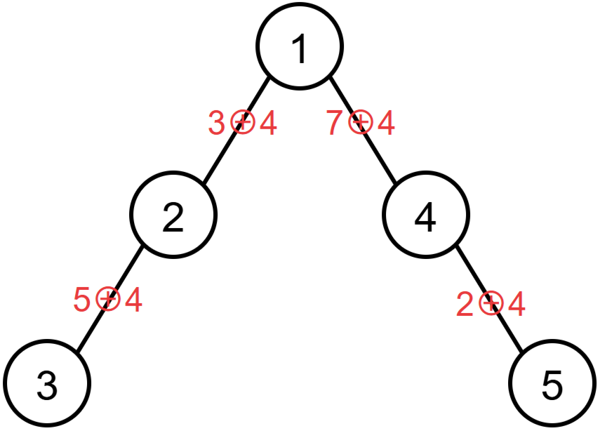

## [树（Tree）](https://codeforces.com/gym/104385/problem/I)

**时间限制：** 1 s
**内存限制：** 512 MB

**输入：** 标准输入
**输出：** 标准输出


Setsuna 拥有一棵包含 $n$ 个节点的树。每条边都有一个权值 $w_i$。接下来她将执行 $q$ 次操作。操作有两种类型：

类型 $1$：给出三个整数 $x\ y\ z$，将从 $x$ 到 $y$ 的 **简单路径** 上的 **每一条边** 的权值进行修改。若一条边的原始权值为 $w$，则修改后变为 $w \oplus z$。其中 $\oplus$ 表示按位异或操作。

类型 $2$：给出一个整数 $x$，你需要输出 **所有与 $x$ 相连的边的权值的异或和**。

一棵 $n$ 个节点的树被定义为一个包含 $n$ 个节点和 $n-1$ 条边的无向连通图。简单路径是指图中不包含重复节点的一条路径。


### 输入

第一行包含两个整数 $n$，$q$（$1 \le n$，$q \le 5 \times 10^5$），表示树的节点数和操作数。

接下来的 $n-1$ 行，每行包含三个整数 $x$，$y$，$w$（$1 \le x$，$y \le n$，$0 \le w < 2^{20}$），表示存在一条连接 $x$ 和 $y$ 的边，权值为 $w$。

接下来的 $q$ 行，每行以一个整数 $op$（$1 \le op \le 2$）开头。

若 $op=1$，表示该操作为类型 $1$，接下来是三个整数 $x$，$y$，$z$（$1 \le x$，$y \le n$，$0 \le z < 2^{20}$）。

若 $op=2$，表示该操作为类型 $2$，接下来是一个整数 $x$（$1 \le x \le n$）。


### 输出

对于类型 $2$ 的每个操作，输出一行，表示答案。

 


### 样例

**样例输入：**

```cpp
3 3
1 2 1
1 3 2
2 1
1 1 3 2
2 1
```


**样例输出：**

```cpp
3
1
```


### 注意

==这题不是多测！！！==

这题和树没有关系，但可以选做。


### 题解

以下是一个结点数为 $5$ 的树，对从 $3$ 到 $5$ 的简单路径上的所有边都异或 $4$

            $\LARGE\Longrightarrow$            

从上图中可以看出，每次类型为 $1$ 的操作路径上除了 $x$ 和 $y$ 这两个端点，每个中间结点连接的相邻边一共会被异或 $z$ 两次，而由于两次异或相当于没变（即 $z \oplus z = 0$），所以这些中间结点的边权值在最终异或和中不会发生变化。

但对于 $x$ 和 $y$，它们的相邻边只被异或了一次 $z$，所以在计算整个路径的边权异或和时，相当于在原本的异或和基础上额外多异或了一次 $z$。


```cpp
void solve()
{
	int n, p, q, x, y, z;
	cin >> n >> q;
	vector<int> ans(n + 1);
	for (int i = 1; i < n; ++i)
	{
		cin >> x >> y >> z;
		ans[x] ^= z, ans[y] ^= z;
	}
	while (q--)
	{
		cin >> p;
		if (p == 1)
		{
			cin >> x >> y >> z;
			ans[x] ^= z, ans[y] ^= z;
		}
		else
		{
			cin >> x;
			cout << ans[x] << endl;
		}
	}
}
```