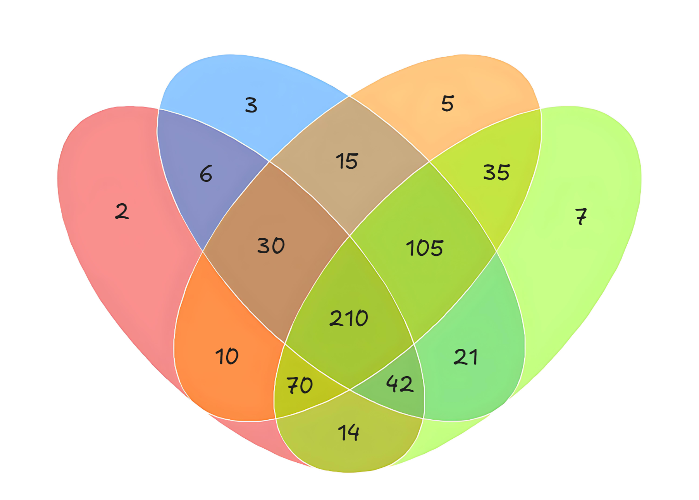

### [统计好数字（Count Good Numbers）](https://codeforces.com/contest/2125/problem/C)

**时间限制：** 2 s
**内存限制：** 512 MB

**输入：** 标准输入
**输出：** 标准输出


一个**质数**是指正整数中恰好有两个约数的数：$1$ 和它本身。前几个质数为 $2$，$3$，$5$，$7$，$11$，$\dots$。

一个正整数的**质因数分解**是将其表示为若干质数的乘积。例如：

- $111$ 的质因数分解为 $3 \cdot 37$；
- $43$ 的质因数分解为 $43$；
- $12$ 的质因数分解为 $2 \cdot 2 \cdot 3$。

对于每一个正整数，它的质因数分解是唯一的（如果不考虑质数排列的顺序）。

我们称一个正整数是**好数**，当且仅当它质因数分解中的**所有质数**都是**至少两位数**。例如：

- $343 = 7 \cdot 7 \cdot 7$ 不是好数；
- $111 = 3 \cdot 37$ 不是好数；
- $1111 = 11 \cdot 101$ 是好数；
- $43 = 43$ 是好数。

你需要计算从 $l$ 到 $r$（包含端点）中有多少个好数。


### 输入

第一行包含一个整数 $t$（$1 \le t \le 10^3$），表示测试用例的数量。

每个测试用例占一行，包含两个整数 $l$ 和 $r$（$2 \le l \le r \le 10^{18}$）。


### 输出

对于每个测试用例，输出一个整数，表示从 $l$ 到 $r$ 中有多少个好数。

 


### 样例

**样例输入：**

```
4
2 100
2 1000
13 37
2 1000000000000000000
```


**样例输出：**

```
21
227
7
228571428571428570
```


### 注意

在第一个测试用例中，共有 $[11$，$13$，$17$，$19$，$23$，$29$，$31$，$37$，$41$，$43$，$47$，$53$，$59$，$61$，$67$，$71$，$73$，$79$，$83$，$89$，$97]$  $21$ 个好数。

在第三个测试用例中，共有 $[13$，$17$，$19$，$23$，$29$，$31$，$37]$ $7$ 个好数。


### 题解

首先值得一提的是，如果你需要计算区间 $[l$，$r]$ 中某些整数的数量，通常更方便的方法是这样做：计算 $[0$，$r+1)$ 中这样的整数的数量，然后减去 $[0$，$l)$ 中的数量。在前缀中计算整数的数量通常比在区间中计算要简单得多。

让我们稍微修改一下好数的定义。如果一个整数的所有质因数都至少包含两位数字，那么它就不被前四个质数（$2$，$3$，$5$，$7$）整除。类似地，如果一个数不是好数，那么它至少被这四个数中的一个整除。

让我们理解如何计算在区间 $[1$，$k]$ 中与 $210$ 互质的整数数量（如果一个数与 $210$ 互质，那么它是好数，因为它不被我们感兴趣的任何质数整除）。我们将形成四个集合 $S_2$，$S_3$，$S_5$，$S_7$，其中 $S_i$ 包含从 $1$ 到 $k$ 中所有被 $i$ 整除的整数。使用包容-排除公式，我们可以更具下图找到这四个集合的并集：

<center></center>

$$
|S_2| + |S_3| + |S_5| + |S_7| - |S_2 \cap S_3| - |S_2 \cap S_5| - \dots + |S_2 \cap S_3 \cap S_5| + |S_2 \cap S_3 \cap S_7| + \dots - |S_2 \cap S_3 \cap S_5 \cap S_7|
$$

* 我们如何计算 $|S_i|$？它就是 $\lfloor \frac{k} {i} \rfloor$，因为我们需要的正好是数字 $i$，$2i$，$\dots$；
* 我们如何计算几个集合 $S_i$ 的交集大小？如果一个数字被多个质数整除，那么它就被它们的乘积整除，因此实际上集合 $S_{p_1} \cap S_{p_2} \cap \dots \cap S_{p_m}$ 可表示为 $S_{\prod p_i}$；


```cpp
int nums[15] = {2, 3, 5, 7, -6, -10, -14, -15, -21, -35, 30, 42, 70, 105, -210};  
void solve()  
{  
    int l, r;  
    cin >> l >> r;  
    static auto count = [&](int n, int m = 0) -> int  
    {  
       for (int i = 0; i < 15; ++i)  
          m += n / nums[i];  
       return n - m;  
    };  
    cout << count(r) - count(l - 1) << endl;  
}
```