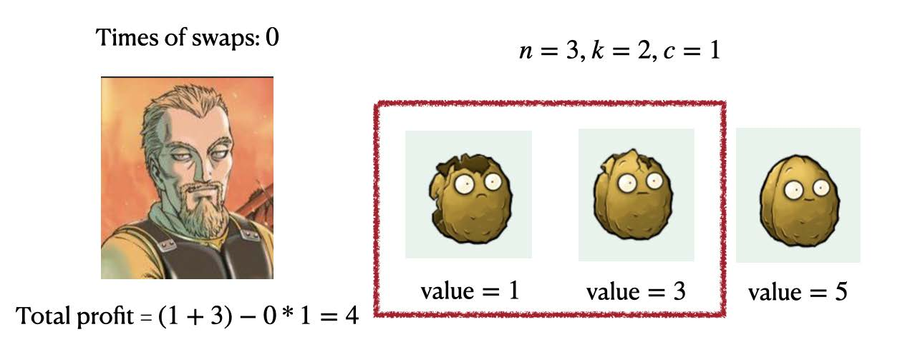

## [为了宝藏（For the Treasury）](https://ac.nowcoder.com/acm/contest/108301/F)

**时间限制：** 2 s
**内存限制：** 1024 MB

**输入：** 标准输入
**输出：** 标准输出


公元11世纪初，有一些被称为维京人的丹麦人侵吞在英格兰活动。

Askeladd 是一群维京海盗的领袖，他在这片肥沃的土地上寻找宝藏。在一夜袭击了一个村庄后，他们共收集了 $n$ 个宝藏，其价值分别为 $a_1$，$a_2$，$\ldots$，$a_n$。Askeladd 的团队有一项关于如何分配这些宝藏的规定：传说中领袖 Askeladd 将获取他 **前面所排** 的 $k$ 个宝藏，即值为 $a_1$，$a_2$，$\ldots$，$a_k$ 的宝藏，而其余海盗将分配其余的宝藏。但由于时间太晚，他们决定在第二天早上进行这个分配。

Askeladd 需稍作思考，他在夜间偷偷摸摸地返回重新安排宝藏，以便他可以获得更多的宝藏总价值。幸运的是，Askeladd 具有一种 **神奇的能力：相邻两个宝藏的交换**。考虑到被其他海盗发现的风险，每次交换将花费 Askeladd 的代价。Askeladd 可以执行任意数量（可能为零）的交换。

Askeladd 想知道他可以获得的最大利润是多少（即他可以获得的所有宝藏的价值减去交换所消耗的总代价）。


### 输入

第一行包含三个整数 $n$，$k$，$c$（$0 \leq k \leq n \leq 3 \times 10^5$，$0 \leq c \leq 10^9$），表示宝藏的总数量、Askeladd 取走的宝藏数量，以及交换相邻两个宝藏的成本。

接下来一行包含 $n$ 个整数 $a_1$，$a_2$，$\ldots$，$a_n$（$1 \leq a_i \leq 10^9$），表示宝藏的价值。


### 输出

在一行中输出一个整数，表示 Askeladd 能获得的最大利润。


### 样例

**样例输入：**

```cpp
// 样例输入1
3 2 1
1 3 5

// 样例输入2
3 2 2
1 3 5

// 样例输入3
4 2 1
2 3 5 6

// 样例输入4
7 3 2
2 1 3 6 10 9 7
```


**样例输出：**

```cpp
// 样例输出1
6

// 样例输出2
4

// 样例输出3
7

// 样例输出4
10
```


### 注意

==这题不是多测！！！==

为了帮助理解，我们提供了第一个样例的图示说明。当 Askeladd 不进行任何交换时，他获得的总利润等于 $4$。




Askeladd 的最佳方法是先交换第一个和第二个宝藏，


然后交换第二和第三个宝藏，总利润为6。


### 题解

阿谢拉特的目标是最大化利润，即（宝藏总价值）-（移动总代价）。

我们可以这样思考：先为每个宝藏评估一个 "潜力得分"。不妨假设把任意一个在位置 $j$ 的宝藏移动到第一位，它能产生的净收益是 $a_j - c \cdot (j-1)$。我们就用这个值作为所有宝藏的“潜力得分”，并进行排序。得分最高的 $k$ 个宝藏，就是我们应该选择的目标。

但是，这个计算方式有一个前提：我们假设了选中的这 $k$ 个宝藏都被移到了第一位。实际上，它们最终是移动到第 $1$，$2$，$\ldots$，$k$ 这 $k$ 个位置。

因此，我们最初的计算高估了移动代价。相比于全部移动到第一位，将它们分别移动到正确的前 $k$ 个位置，实际上要节省 $c \cdot \sum_{i=1}^{k-1} i$ 的代价。这部分被高估的代价需要被加回到最终的利润中。

所以，最终的最大利润就是：将所有宝藏的 "潜力得分" $a_j - c \cdot (j-1)$ 排序后，取前 $k$ 名的得分相加，然后再加回被我们高估的那部分移动代价 $c \cdot \frac{k(k-1)}{2}$ 即可。


```cpp
void solve()
{
    int n, k, c;
    cin >> n >> k >> c;
    vector<int> nums(n);
    for (int i = 0; i < n; ++i)
    {
        cin >> nums[i];
        nums[i] -= i * c;
    }
    sort(nums.begin(), nums.end(), greater<int>());

    int ans = 0;
    for (int i = 0; i < k; ++i)
        ans += nums[i];
    cout << ans + (k - 1) * k * c / 2 << endl;
}
```