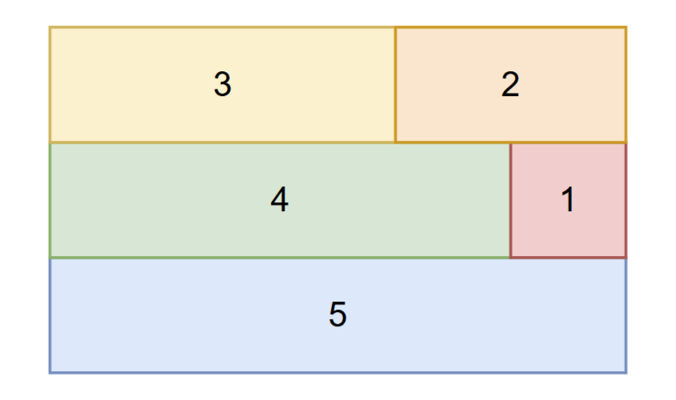

### [方块组合的最小周长（Block Combination Minimal Perimeter）](https://ac.nowcoder.com/acm/contest/108302/I)

**时间限制：** 1 s
**内存限制：** 512 MB

**输入：** 标准输入
**输出：** 标准输出


给定 $n$ 个矩形方块，其中第 $i$ 个方块的尺寸为 $1 \times i$。你需要将所有方块组合成一个实心的矩形（**不允许重叠或有空隙**）。求出所形成矩形的 **最小周长**。

保证在给定的数据范围下，你总能合成一个实心的矩形。


### 输入

第一行包含一个整数 $n$（$1 \le n \le 2 \times 10^5$），表示方块的数量。


### 输出

输出一个整数，表示所形成矩形的最小周长。


### 样例

**样例输入：**

```cpp
// 样例输入1
1

// 样例输入2
6

// 样例输入3
10
```


**样例输出：**

```cpp
// 样例输出1
4

// 样例输出2
20

// 样例输出3
32
```


### 注意

==这题不是多测！！！==

在第一个测试用例中：由于只有一个方块，所以无法进行组合，所以周长为方块的周长 $4$。


### 题解

设最终矩形边长为 $a$ 和 $b$。显然，面积一定时，$\max(a$，$b)$ 越小，矩形周长越小。
由于大小为 $1 \times n$ 积木的存在，$\max(a$，$b) \geq n$。

* 当 $n$ 为奇数时，一定可以构造 $\max(a$，$b) = n$ 的矩形：
	将 $1 \times i$  和 $1 \times (n - i)$ 的积木两两配对，最终我们得到了 $\large{\left\lfloor \frac{n}{2} \right\rfloor} + 1$ 块 $1 \times n$ 的积木

* 当 $n$ 为偶数时，构造不出 $\max(a$，$b) = n$ 的矩形：
	因为 $S = n \times (n + 1)\ /\ 2$，而 $(n + 1)$ 为奇数，显然 $n$ 无法是 $S$ 的一个因子，但一定可以构造 $\max(a$，$b) = n + 1$ 的矩形。
	将 $1 \times i$  和 $1 \times (n  + 1 - i)$ 的积木两两配对，最终我们得到了 $\large\frac{n}{2}$ 块 $1 \times (n + 1)$ 的积木

综上所述，最小矩形周长为：$2 \left( n + \large{\left\lfloor \frac{n}{2} \right\rfloor} + 1 \right)$


下面以 $n = 5$ 和 $n = 6$ 画图举例：

<div style="display: flex; align-items: center;">
	
	
</div> 


```cpp
void solve()  
{  
    int n;  
    cin >> n;  
    cout << 2 * (n + n / 2 + 1) << endl;  
}
```