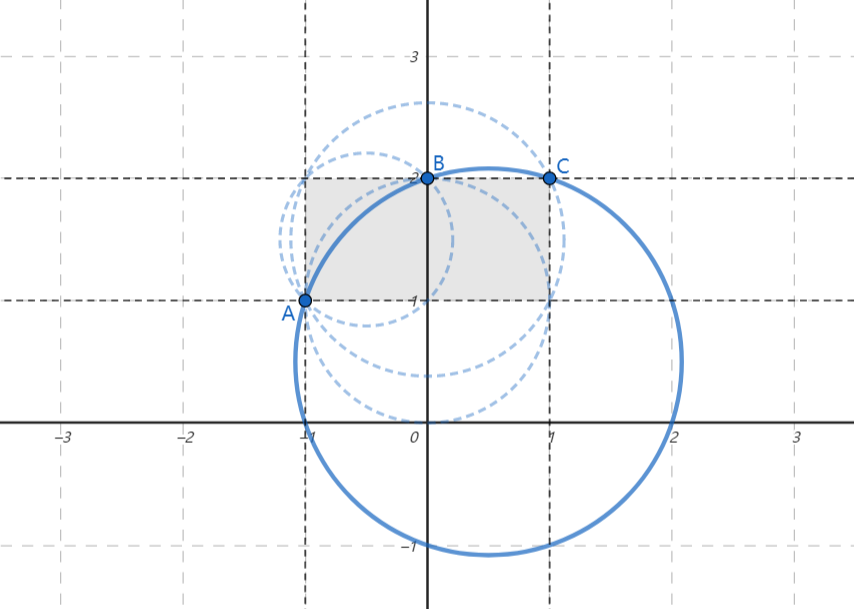

### [一起画很大的圆（Let's Draw a Big Circle Together）](https://ac.nowcoder.com/acm/contest/95334/H)

**时间限制：** 1 s
**内存限制：** 1024 MB

**输入：** 标准输入
**输出：** 标准输出


牛可乐正在研究二维平面。现在，他已经划定了一个矩形区域，左侧边界为 $x=a$，右侧边界为 $x=b$，下侧边界为 $y=c$，上侧边界为 $y=d$，他想要在四条直线所围成的矩形的 **边界上** 找到三个不同的整数点 $A$，$B$，$C$，使得过这三个点画出的圆半径最大。  

请你帮助他实现！


### 输入

每个测试文件中包含多个测试数据。第一行输入一个整数 $t$（$1 \leq t \leq 100$）表示数据组数，每组测试数据描述如下：

在一行上输入四个整数 $a$，$b$，$c$，$d$（$-10^6 \le a$，$b$，$c$，$d \le 10^6;\ a < b;\ c < d$）代表牛可乐选定的区域左、右、下、上边界。


### 输出

对于每一组测试数据，输出三行。每行输出两个整数，代表你所选定点的横纵坐标。你需要确保这三个点位于区域边界上，且过三点能作出一个合法的圆（互不相同、不共线）。  

如果存在多个解决方案，您可以输出任意一个，系统会自动判定是否正确。注意，自测运行功能可能因此返回错误结果，请自行检查答案正确性。


### 样例

**样例输入：**

```cpp
2
-1 1 1 2
0 1 0 1
```


**样例输出：**

```cpp
-1 1
0 2
1 2
0 0
0 1
1 1
```


### 注意

对于第一组测试数据，一共可以作出如下图所示的四个合法圆，我们可以证明，实线的圆是其中最大的。




### 题解

明天发！！！


```cpp
void solve()
{
	/*code*/
}
```