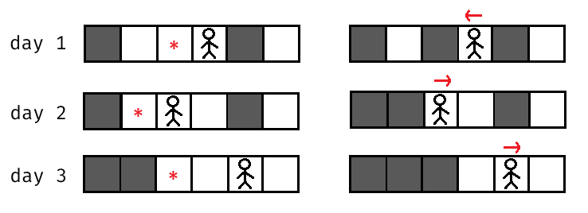
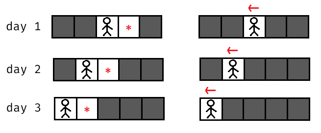

## [哈米米德，哈哈米德 ... 哈米德？（Hamiiid, Haaamid... Hamid?）](https://codeforces.com/contest/2127/problem/B)

**时间限制：** 1 s
**内存限制：** 1024 MB


Mani 将 Hamid 锁在了一个 $1 \times n$ 的网格中。最初，网格的某些单元格有墙，其余为空，Hamid 在一个空的单元格中。

在每一天，以下事件按顺序发生：

1.  Mani 选择一个空的单元格并在其中建造一堵墙。请注意，他 **不能在 Hamid 当前所在的单元格中建造墙壁**；

2.  Hamid 选择一个方向（左或右），然后
    -   如果该方向没有墙，他将逃离网格；
    -   否则，他将 **移动到该方向最近的墙并摧毁它**。之后，Hamid 的位置就在被摧毁的墙那里。

这是一个当 $n=6$ 时可能的操作序列示例：



Hamid **总是知道墙在哪里**。他希望最小化逃离网格所需的天数，而 Mani 则希望最大化这个天数。

你需要确定在双方都采取最优策略的情况下，Hamid 需要多少天才能逃离网格。


### 输入

每个测试包含多个测试用例。第一行包含测试用例的数量 $t$（$1 \le t \le 10^4$）。接下来是测试用例的描述。

每个测试用例的第一行包含两个整数 $n$ 和 $x$（$2 \leq n \leq 2 \cdot 10^5$，$1 \leq x \leq n$），分别表示网格的大小和 Hamid 的初始位置。他最初在从左到右的第 $x$ 个单元格。

第二行包含一个长度为 $n$ 的字符串 $s$（$s_i=\texttt{"\#"}$ 或 $\texttt{"."}$），表示网格的初始状态。如果 $s_i= \texttt{"\#"}$，则网格的第 $i$ 个单元格有墙；如果 $s_i=\texttt{"."}$，则为空。

保证第 $x$ 个单元格是空的，并且网格中至少有两个空单元格。

保证所有测试用例的 $n$ 的总和不超过 $2 \cdot 10^5$。


### 输出

对于每个测试用例，输出一个整数。在双方都采取最优策略的情况下，Hamid 逃离网格所需的天数。


### 样例

**样例输入：**

```cpp
4
3 1
..#
4 2
....
5 3
##..#
6 4
#...#.
```


**样例输出：**

```cpp
1
1
3
3
```


### 注意

==该题目属于思路很简单，代码必出错的题，请仔细检查代码！！！==
  
在第一个测试用例中，Mani 必须在单元格 $2$ 中建造一堵墙，所以 Hamid 可以在第一天从网格的左侧逃脱。

在第二个测试用例中，如果 Mani 在 Hamid 的左边放置墙，Hamid 可以从右边逃脱。如果墙在 Hamid 的右边，他可以从左边逃脱。因此，答案是 $1$。

在第三个测试用例中：



可以证明，在上图中，双方玩家都采取了最优策略。

在第四个测试用例中，我们在题目描述中展示了一个操作示例。请注意，在这个例子中，玩家们没有采取最优策略。


### 题解

若 Hamid 的初始位置在 $1$ 或 $n$，或其左右均无墙，他首日即可逃脱。

其他情况下，Mani 为最大化天数，总会紧邻 Hamid 筑墙。Hamid 随之决策：是摧毁这堵新墙前进一步，还是转向另一侧最近的墙体。

Hamid 的最优策略是选定一个方向后不再回头，由于 Mani 每日可建一堵墙，即便道路畅通，Hamid 每日也只能前进一步。因此，我们需分别计算 Mani 封锁左侧和右侧两种情况下，Hamid 选择最优方向（向左或向右）逃脱的较小天数。Mani 会预判并实施能使这个 "较小天数" 最大化的封锁方案，故最终结果为这两个较小天数中的最大值。


```cpp
void solve()  
{  
    int n, x, l, r;  
    string str;  
    cin >> n >> x >> str;  
    l = r = x;  
    str = " " + str;  

    while (l >= 1 && str[l] == '.') l--;  
    while (r <= n && str[r] == '.') r++;  

    cout << max(min(x - 1, n - r + 1), min(l, n - x)) + 1 << endl;  
}
```