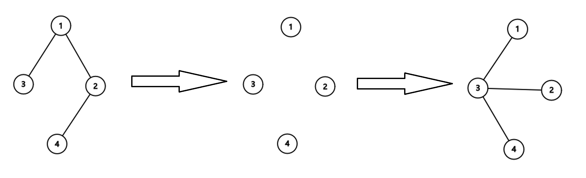

## [树之收缩（Arboris Contractio）](https://codeforces.com/contest/2131/problem/D)

**时间限制：** 2 s
**内存限制：** 256 MB


Kagari 正准备将一棵树存档，她知道存档的成本将取决于其 <u>直径</u>$\large^{\text{∗}}$。为了降低开销，她的目标是首先 **将直径尽可能地缩小**。她可以对树执行以下操作：

1.  选择两个顶点 $s$ 和 $t$。设从 $s$ 到 $t$ 的 <u>简单路径</u>$\large^{\text{†}}$ 上的顶点序列为 $v_0$，$v_1$，$\dots$，$v_k$，其中 $v_0 = s$ 且 $v_k = t$。
2.  **移除路径上的所有边**。换句话说，移除边 $(v_0$，$v_1)$，$(v_1$，$v_2)$，$\dots$，$(v_{k-1}$，$v_k)$。
3.  将顶点 $v_1$，$v_2$，$\dots$，$v_k$ 直接连接到 $v_0$。换句话说，添加边 $(v_0$，$v_1)$，$(v_0$，$v_2)$，$\dots$，$(v_0$，$v_k)$。

可以证明，操作后该图仍然是一棵树。

请帮助她确定，为了达到可能的最小直径，所需的最少操作次数是多少。


$\large^{\text{∗}}$树的直径是任意一对顶点之间可能的最长距离。距离本身由连接它们的唯一简单路径上的边数来衡量。

$\large^{\text{†}}$简单路径是树中两个顶点之间的路径，它不会多次访问任何顶点。可以证明，任意两个顶点之间的简单路径总是唯一的。


### 输入

每个测试包含多个测试用例。第一行包含测试用例的数量 $t$（$1 \le t \le 10^4$）。接下来是各个测试用例的描述。

每个测试用例的第一行包含一个整数 $n$（$2 \le n \le 2 \cdot 10^5$），树中顶点的数量。

每个测试用例的接下来 $n-1$ 行描述了这棵树。每行包含两个整数 $u$ 和 $v$（$1 \le u$，$v \le n$，$u \neq v$），表示顶点 $u$ 和 $v$ 之间存在一条边。保证这些边构成一棵树。

保证所有测试用例的 $n$ 的总和不超过 $2 \cdot 10^5$。


### 输出

对于每个测试用例，输出一个整数，达到最小直径所需的最少操作次数。


### 样例

**样例输入：**

```cpp
4
4
1 2
1 3
2 4
2
2 1
4
1 2
2 3
2 4
11
1 2
1 3
2 4
3 5
3 8
5 6
5 7
7 9
7 10
5 11
```


**样例输出：**

```cpp
1
0
0
4
```


### 注意

==这题和树没有关系！！！==

在第一个测试用例中，原始树的直径为 $3$。Kagari 可以对 $s = 3$ 和 $t = 4$ 执行一次操作。如下图所示，该操作包括以下步骤：

1.  移除边 $(3$，$1)$、$(1$，$2)$ 和 $(2$，$4)$。
2.  添加边 $(3$，$1)$、$(3$，$2)$ 和 $(3$，$4)$。



操作后，直径减小到 $2$。可以证明 $2$ 是最小的可能直径。

在第二个测试用例中，树的直径为 $1$。可以证明 $1$ 已经是最小值，所以 Kagari 可以不执行任何操作。


### 题解

我们可以通过 $n - 1$ 次操作，将任意一个节点变为中心，所有其他节点都与其直接相连，从而使树的直径最小化为 $1$。因此，问题转化为求最少操作次数。

首先，任选一节点 $r$ 作为根。记 $p_u$ 为 $u$ 的父节点，$d_u$ 为 $u$ 的深度。我们定义 $d_u$ 如下：
-   $d_r=0$；
-   $d_u=d_{p_u}+1$。

深度不大于 $1$ 的顶点（即根及其直接子节点）已在所需位置，无需操作。要将所有节点都与根 $r$ 直接相连，只需对每个深度大于 $1$ 的叶子 $l$ 执行一次以 $(r, l)$ 为端点的路径操作。该操作可以修正叶子 $l$ 及其到根的路径。

故以 $r$ 为根的最小操作次数，等于其深度大于 $1$ 的叶节点数量。最终答案即为遍历所有节点作为根，并取计算出的操作数最小值。特别地，当 $n=2$ 时，直径已为 $1$，无需操作。


```cpp
void solve()
{
    int n, u, v;
    cin >> n;
    vector<vector<int>> mp(n + 1);
    for (int i = 2; i <= n; ++i)
    {
        cin >> u >> v;
        mp[u].push_back(v);
        mp[v].push_back(u);
    }

    int ans = 0, cnt = 0;
    for (int i = 1; i <= n; ++i)
    {
        if (mp[i].size() == 1) ans++;
        int tem = 0;
        for (int j = 0; j < mp[i].size(); ++j)
            if (mp[mp[i][j]].size() == 1) tem++;
        cnt = max(cnt, tem);
    }
    if (ans == 2 && n == 2)
        cout << 0 << endl;
    else
        cout << ans - cnt << endl;
}
```