# 1计算机系统概述

将该图片中的内容归纳为markdown笔记，且不要使用小标题，小标题用数字清单代替，且所有数学符号都用mathtype表示，回答的时候不要在$前后加`符号，且在每个mathtype表达前后加空格，但mathtype表达中不要加入空格，可适当补充，令笔记完整，但笔记内容要简洁


# 2 数据的表示和运算

## 2.1 数制与编码

### 2.1.1 进位计数制及其相互转换

1. 进制：基数为 $r$ 的情况下，每个数码位可能出现  种字符，运算时逢 $r$ 进 1
	O 表示 8 进制，D 表示 10 进制，H 表示16 进制
	
2. 2进制 ↔ 8/16进制
	每 **3/4** 个二进制位对应一个 8/16 进制位，转换时可能需要在高位或低位 **补位** （通常补0）以凑足  3/4 位。
	
3. 十进制 → r 进制
	* 整数部分：
		除基取余法：持续将整数部分除以基数 $r$，取其余数，直到商为0。先取得的 **余数** 是 $r$ 进制数的 **低位
	
	* 小数部分：
		乘基取整法：持续将小数部分乘以基数 $r$，取其整数，直到小数部分为0或达到所需精度。先取得的 **整数** 是 $r$ 进制数的 **高位**
	
4. 真值和机器数
	* 真值：实际的、带正负号的数值，是人类习惯的表示方式。
	* 机器数：把正负号进行数字化编码后的数，是数值在计算机内部的实际存储形式。
	
5. 原码：数据的二进制表示，最高位表示符号（整数表示范围为 $-2^n+1 \le x \le 2^n-1$ ；小数表示范围为 $-(1-2^{-n}) \le x \le 1-2^{-n}$ ，$n$ 为原码 bit 数减一）
	反码：原码变为补码的中间态，==如果原码符号位为 0，则不变换；如果原码符号位为 1，则除符号位的所有位置取反==
	补码：在计算机中计算使用补码，==如果原码符号位为 0，则不变换；如果原码符号位为 1，则将在反码的基础上加 1==（补码变原码可以先减 1 再取反，也可以先取反再加 1）
	移码：通常用于比较大小，==在原码的基础上加一个偏移量==（偏移量为 $2^{n-1}$，$n$ 为总位数）
	
	注意事项：原码和反码对于真值 0 有两种表示方式，而补码和移码只有一种表示方式


### 2.1.2 定点数的编码表示

* 定点数和浮点数的区别：小数点位置是否固定
	
	![[定点整数和定点小数.png]]
	
* 无符号整数所有二进制位都为数值位，用来表示数值，没有符号位
	有符号整数的最高位用于表示符号，$0$ 表示正数，$1$ 表示负数
	


## 2.2 运算方法和运算电路

### 2.2.1 基本运算部件

#### 2.2.1.2 加法器

1.  **一位全加器 (FA)**

    一位全加器是执行 $1$ bit二进制数加法的基础单元。

    *   **功能**: 只能支持 $1$ bit 加法。
    *   **实现**:
        *   **本位和 (Sum)**: $S_i = A_i \oplus B_i \oplus C_{i-1}$
        *   **向高位的进位 (Carry-out)**: $C_i = A_iB_i + (A_i \oplus B_i)C_{i-1}$

2.  **并行加法器**

    通过串联多个一位全加器来实现多位二进制数的并行加法。

    *   **串行进位**
        *   **实现**: 将 $n$ 个一位全加器简单串联，可支持n bit并行加法。
        *   **缺点**: 进位信息是串行产生的，运算速度较慢。
    *   **并行进位**
        *   **实现**: 对“串行进位”的加法器电路进行优化，增加CLA部件。
        *   **优点**: 进位信息是并行产生的，运算速度更快。

3.  **带标志位的加法器**

    在并行加法器的基础上，增加电路逻辑，用于输出OF、SF、ZF、CF等标志位。

    *   **OF (Overflow Flag - 溢出标志)**
        *   **功能**: 反映 **有符号数** 加减运算结果是否发生溢出。OF=1表示发生了溢出。
        *   **公式**: $OF = C_n \oplus C_{n-1}$
    *   **SF (Sign Flag - 符号标志)**
        *   **功能**: 反映 **有符号数** 加减运算结果的正负性。它也就是取运算结果的最高位（符号位）。
        *   **公式**: $SF = S_n$
    *   **ZF (Zero Flag - 零标志)**
        *   **功能**: 反映加减运算结果是否为0。ZF=1表示运算结果为0。
        *   **公式**: $ZF = \overline{S_n + S_{n-1} + \dots + S_1}$ （仅当运算结果所有bit全为0时，ZF才为1）
    *   **CF (Carry Flag - 进位标志)**
        *   **功能**: 反映 **无符号数** 加减运算是否发生了溢出。当CF=1时说明发生了溢出。
        *   **公式**: $CF = C_{out} \oplus C_{in} = C_n \oplus C_0$


#### 2.2.1.2 ALU 算术逻辑单元

1.  **功能**
    *   **算术运算**: 加、减、乘、除等。
    *   **逻辑运算**: 与、或、非、异或、移位等。
    *   **其他**: 求补码、直送等。
    *   ALU总共支持 $k$ 种功能。

2.  **实现原理**：多个功能电路 + MUX (多路选择器)，通过控制信号选通MUX的某个线路，从而选择执行特定的功能。

3.  **看懂ALU图示**
	<div style="display: flex; align-items: center;">
		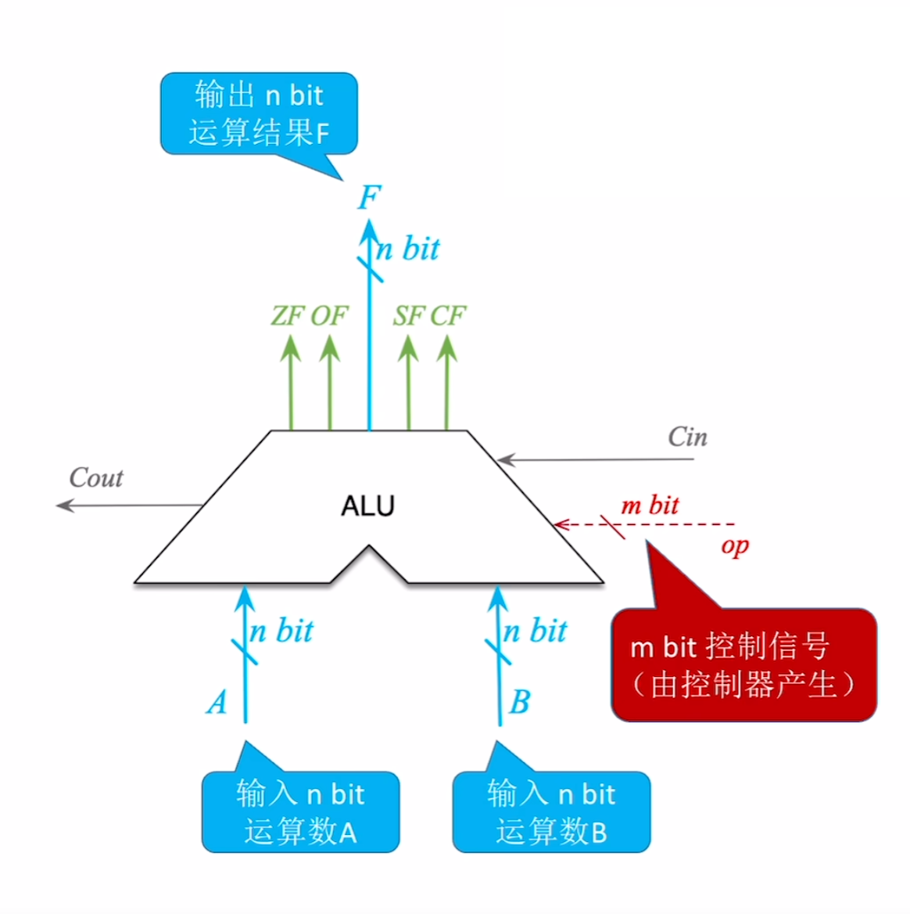
	</div> 
    *   **输入**
        *   **两个 n bit 运算数 A、B**: n与机器字长相同。
        *   **m bit 控制信号**: 由控制器经过指令译码产生，用于选择ALU要执行的功能。控制信号的位数 m 满足 $m \geq \lceil \log_2 k \rceil$ bit。
        *   **其他输入信号**: 例如来自更低位的进位信息。
    *   **输出**
        *   **n bit 运算结果 F**: n与机器字长相同。
        *   **OF/ZF/SF/CF等标志信息**: 这些标志位信息会送入PSW寄存器（又称FR，标志寄存器）。
        *   **其他输出信号**: 例如往更高位的进位信息。

4.  **考点补充**
    *   CPU主要由 **运算器** 和 **控制器** 组成。
    *   ALU是 **运算器** 的核心。
    *   **加法器** 是ALU的核心（因为加、减、乘、除运算最终都是基于加法实现的）。


### 2.2.2 定点数的移位运算

移位类型分为两种

1. **逻辑移位**
	常用于无符号整数。
	* **逻辑左移**：高位移出丢弃，低位补 $0$；若高位移出 $1$，则发生溢出。
	* **逻辑右移**：低位移出丢弃，高位补 $0$；若低位移出 $1$，则丢失精度。


2. **算数移位**
	常用于带符号整数。
	* **算数左移**：高位移出丢弃，低位补 $0$；==若左移前后的符号位不同，则发生溢出。==
	* **算数右移**：==低位移出丢弃，高位补符号位；==若低位移出 $1$，则丢失精度。

注意：左移相当于乘以 $2$；右移相当于除以 $2$


### 2.2.3 定点数的加减法运算

1. 原码加减：
	* 同号相加：数值部分为被加数、加数的绝对值进行相加，符号位不变
	* 异号相加：数值部分为绝对值更大的数减去绝对值更小的数，符号位与绝对值更大的数相同
	* 减法：将减数连同符号位一起取反，转变为加法运算
	
2. 补码运算：
	- 符号位参与加法运算；减法需要转变成等价的加法。
	- 已知补码求相反数的补码： ==全部位（包括符号位）取反，末位加 1==
	
3. 溢出判断：
	 ==只有当 A+B 符号相同时才会发生溢出==
	    上溢 正数 + 正数 = 负数
	    下溢 负数 + 负数 = 正数
	
	* 方案一：设 A 的符号为 $A_s$，B 的符号为 $B_s$，运算结果的符号为 $S_s$。
	    溢出逻辑表达式为：$V = A_s B_s \overline{S_s} + \overline{A_s} \overline{B_s} S_s$，==两个正数相加结果为负数，或两个负数相加结果为正数时溢出==
	    $V=1$ 表示有溢出，$V=0$ 表示无溢出。
	
	* 方案二：比较进位
		$C_s$ 为 **符号位** 的进位，$C_1$ 为 **最高数值位** 的进位。
		溢出逻辑表达式为：$V = C_s \oplus C_1$
		若 $C_s$ 与 $C_1$ **不同**，则发生溢出；若 $C_s$ 与 $C_1$ **相同**，则不溢出。
			若 $C_s$ 为 $0$，$C_1$ 为 $1$ 则为上溢；若 $C_s$ 为 $1$，$C_1$ 为 $0$ 则为下溢（都为 $1$，为两个负数相加的情况情况，不溢出）
		
		<div style="display: flex; align-items: center;">
			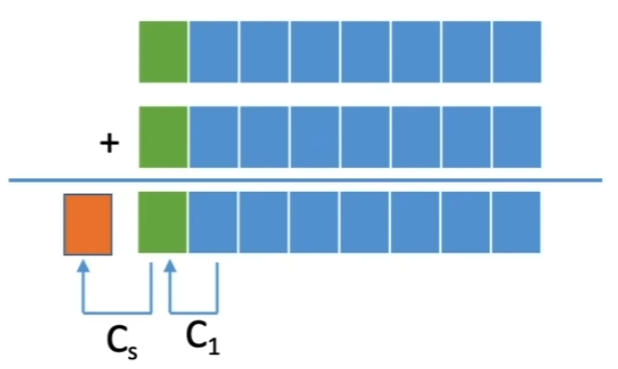
		</div> 
		
	* 方案三：双符号位法
		和方案二原理相同，跳过
	
4. 无符号整数的加减法
	补码加减法的原理和有符号整数一样，在减法时将符号位忽略了（无影响）
	溢出判断：
	* 加法的溢出判断：最高位产生的 **进位=1** 时，发生溢出；否则未溢出。
	* 减法的溢出判断：将减法变加法后，最高位产生的 **进位=0** 时，发生溢出（相当于借位）；否则未溢出。
	（无符号数和它的补数之和是 0，被减数如果和减数的补数之和连 0 都没到，那肯定被减数小于减数结果为负数，在无符号中负数肯定就溢出了）
	
5. 补码加减运算电路
	* 如果为加法运算，按位相加即可
	* 如果为减法运算，将减数全部按位取反，再通过 Cin 实现末位加一，将减法变加法
	
	<div style="display: flex; align-items: center;">
		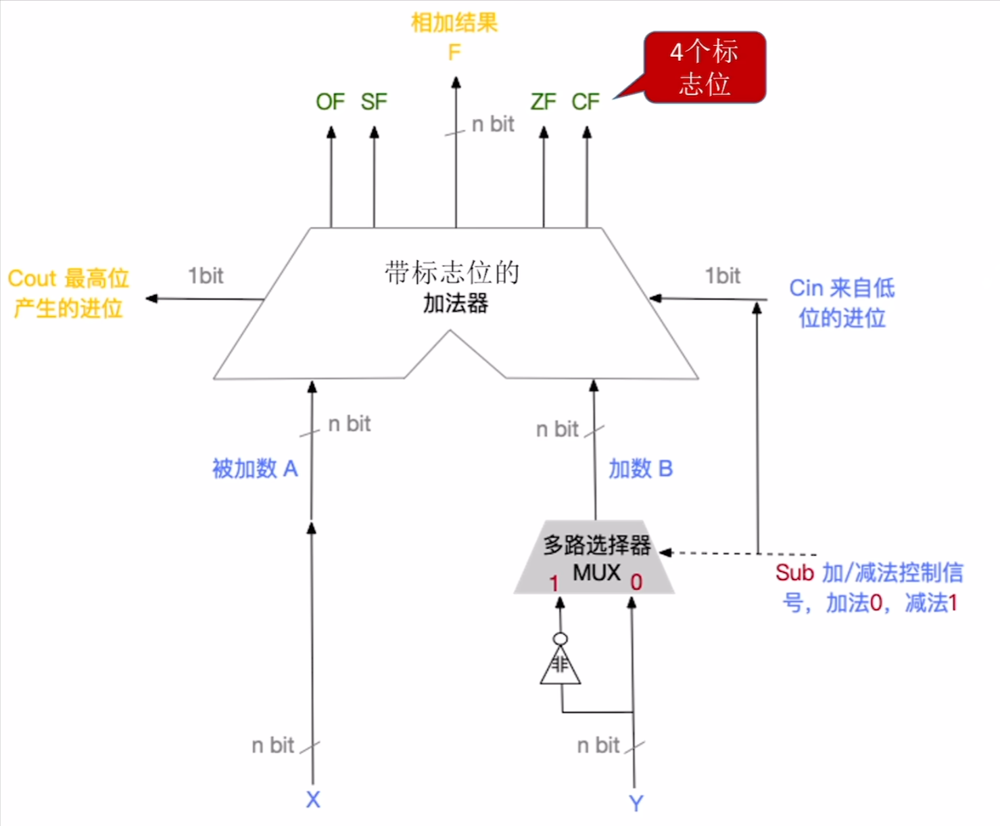
	</div> 


### 2.2.4 定点数的乘除法运算

#### 2.2.4.1 无符号整数乘法

1.  两个 $n$ bit 无符号数的乘法运算，可拆解为 $n$ 轮加法运算。
	根据乘数的各个bit，决定每一轮加法运算是“+被乘数”还是“+全0”。
	注意每一轮加法运算需要与上一轮加法运算的结果“错位相加”。
	
	<div style="display: flex; align-items: center;">
		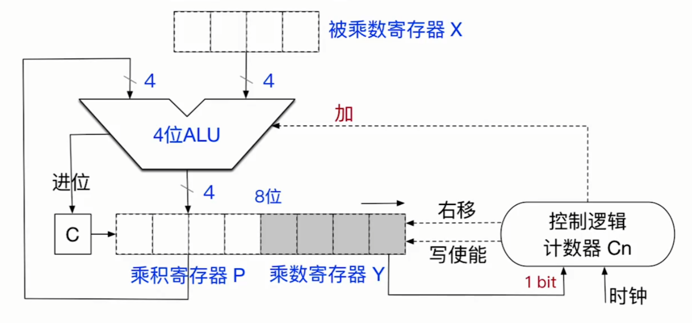
	</div> 
	
2.  开始初始化：
    * 被乘数、乘数分别放入寄存器$X$、$Y$。
    * 乘积寄存器$P$置为 $0$。
    * 计数器 $C_n$ 的初始值置为 $n$ 。
    * 特殊情况：当乘数和被乘数有一个为 $0$，结果直接等于 $0$，不再进行复杂的计算。
	
3.  进行 $n$ 轮处理，直到计数器 $C_n=0$ 为止：
    * 将乘数寄存器 $Y$ 的最低位送入“控制逻辑”进行判断。
    * 若 $Y$ 的最低位为 $1$，则执行加法，运算结果写回 $P$（加法产生的进位需要保存至进位触发器 $C$ ）。若 $Y$ 的最低位为 $0$，则不执行任何操作。
    * 将 $[C, P, Y]$ 视为一个整体，逻辑右移一位。
    * 计数器 $C_n$ 的值减 $1$。
	
4.  结束判断：当计数器 $C_n=0$ 时，乘法运算结束。使用 $2n$ 位的 $[P, Y]$ 暂存乘法运算的完整结果，==但最终仅保留最低的 $n$ 位 $Y$ 做为最终结果。==
	
5.  溢出判断：若为得到 $n$ 位结果而丢弃的高 $n$ 位 $[P]$ 不全为 $0$，则说明发生了溢出，此时需要将溢出标志位 $OF$ 设置为 $1$。
	
6.  对于检测到的溢出，有两种处理方式：
    * **忽略处理**：程序员可以选择忽略乘法溢出，即使结果是错误的也不进行干预。
    * **异常处理**：可以在乘法指令之后执行一条“溢出自陷指令”，当 $OF=1$时，该指令会触发一个“异常处理程序”来专门处理溢出情况。


#### 2.2.4.2 有符号整数乘法

<div style="display: flex; align-items: center;">
	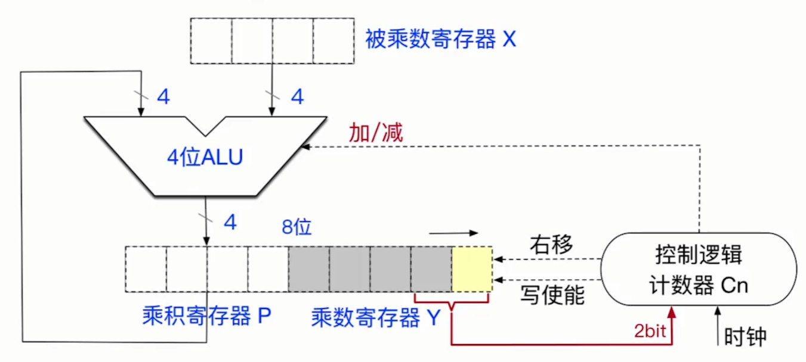
</div> 

有符号整数乘法使用补码表示，其数学原理比无符号整数更复杂，故不去探究原理，仅理解过程！（该方法被称为 ==补码一位乘法==，又称为布斯乘法，由 A.D.Booth 提出）

和无符号整数乘法的区别：

1. 没有触发器 $C$，但在 $Y$ 末位添加辅助位，且辅助位初始为 $0$。
	
2. ==通过 $Y$ 的末位和辅助位来判断进行加法还是减法操作==。
	![[有符号整数乘法操作判断.png]]
	
3. 移位时将 $[P，Y，辅助位]$ 看为一个整体，且整体算数右移一位。
	
4. 溢出判断：$2n$ bit 的前 $n+1$ 位==不完全相同==（要算上符号位） ，即发生溢位

#### 2.2.4.3 计算机乘法的三种实现方式

1. 阵列乘法器（快速乘法器中的一种）：运算速度最快，可 $1$ 个时钟内完成运算
	
2. 由ALU、移位器、寄存器、控制逻辑组成的乘法电路：运算速度较快，通常需多个时钟（$n$ bit 乘法的时间至少要 $n$ 个 时钟），才能完成运算
	可以改进为两位乘法，每次处理乘数寄存器末尾的 $2$ bit 数据 （时间降为 $n/2$ 个时钟）
	
3. 可以使用移位运算、加/减运算等效实现乘法：运算速度最慢（$nk$ 个时钟），但在没有乘法运算电路和不支持乘法指令的计算机中依然可以使用，逻辑类似于快速幂
```cpp
unsigned int multiply_unsigned(unsigned int x, unsigned int y)
{
    unsigned int result = 0;
    for (int i = 0; i < 32; i++)
	{
        unsigned int bit = y & 1;
        if (bit)
            result += x;

        x <<= 1, y >>= 1;
    }
    return result;
}
```


#### 2.2.4.4 无符号整数除法

余数的定义：  被除数 = 商 × 除数 + 余数

**十进制上商规则：** 商×除数 的值，要尽可能接近“中间余数”，但又不能大于中间余数

**二进制上商规则：** 商×除数 的值，要尽可能接近“中间余数”，但又不能大于中间余数。换句话说， 如果 ==中间余数 ≥ 除数，则上商 1；否则上商 0==


<div style="display: flex; align-items: center;">
	
</div> 

该除法器支持 ==2n bit ÷ n bit==，若除数和被除数位数不够，可用 0 补齐

使用步骤：
1. 开始：
	* 数据存入：
		* 除数放入寄存器Y；
		* 被除数放入寄存器 $[R，Q]$ 并完成零扩展
		* 计数器 $C_{n}$ 的初始值为 n
	* 特殊情况检查：
		* 如果除数为0，发生“除数为0”异常，停止除法运算，调出操作系统的异常处理程序
		* 如果 |被除数| < |除数|，则商 = 0，余数=被除数，除法器不必再执行
2. 后续 $n + 1$ 轮处理：
	* 上商规则：如果 $[R] - [Y] \ge 0$ ，说明==当前部分余数足够大，可以减去除数，因此上商为 1；否则，部分余数不够减，上商为 0==
	* 第 $1$ 轮：
		* 如果计算出的第一位商为 $1$ ，这意味着最终的商至少需要 $n+1$ 位才能存储，超出了 $n$ 位的范围。此时会立即触发“**商溢出**”异常，并停止整个除法运算。
        * 如果计算出的第一位商为 $0$ ，这表明最终的商不会溢出。因此，这个测试性的商位会被**丢弃**，计数器 $C_n$ **不会递减**，除法运算继续进入后续的标准流程。
    * 后 $n$ 轮：每轮包含 3 步
	    * 左移：将寄存器对 $[R,Q]$ （其中 $R$ 存放部分余数， $Q$ 存放商）整体逻辑左移一位
        * 上商：根据前述的上商规则（即 $R-Y$ 的结果）来确定当前商位是 $1$ 还是 $0$，并更新到 $Q$ 的最末位。这一步背后可能涉及到加法或减法操作（例如，如果上商为1，则需要更新 $R$ 的值为 $R-Y$ ）。
        * 计数器递减：将计数器 $C_n$ 的值减 1（ $C_n--$ ）。当计数器 $C_n$ 的值减到 $0$ 时，表示所有 $n$ 轮计算已经完成，除法运算结束。
3. 计算结果：
	* 当 $n + 1$ 轮处理后，$R$ 存储了余数，$Q$ 存储了商


## 2.3 浮点数的表示和运算

### 2.3.1  浮点数的表示

#### 2.3.1.1 IEEE 754

计算机中浮点数采用 IEEE 754 标准，分为四个部分组成：

1.  **符号**：符号位决定了数值的正负性。其存储规则为： $0$ 代表正数， $1$ 代表负数。
	
2.  **尾数**：尾数影响数值的精度，尾数的位数越多，精度就越高。在存储时，通常采用规格化尾数，即确保尾数的最高位非 $0$ 数位正好在小数点之前。==对于二进制规格化数，这个最高位的 $1$ 会被省略（隐含存储）==，以节省存储空间。
    *   在一种格式中（双精度），规定小数点位置在52位之前。
    *   在另一种格式中（单精度），规定小数点位置在23位之前。

3.  **阶码**：阶码反映了小数点的实际位置，即数值的缩放因子。它通常用 **移码** 来表示，即真值加上一个固定的偏移量。
    *   对于52位尾数的格式，规定偏移值为 $1023$ 。
    *   对于23位尾数的格式，规定偏移值为 $127$ 。

4.  **基数**：基数是阶码的底数。对于 $K$ 进制，通常默认基数为 $K$ 。在计算机中，基数通常默认为 $2$ ，且不需要专门的硬件进行存储。

<div style="display: flex; align-items: center;">
	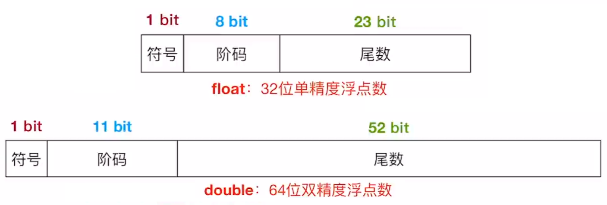
</div> 


#### 2.3.1.2 规格化浮点数和非规格化浮点数
1.  IEEE 754 标准 浮点数主要分类：规格化浮点数、非规格化浮点数，和特殊值
	* **规格化浮点数**：
		阶码：不为全 $0$，也不为全 $1$ 
		尾数：小数点前隐含了一个值为 $1$ 的整数部分（即尾数的真值为 $1.f$ ，其中 $f$ 是存储的尾数位）
	* **非规格化浮点数**：
		阶码：全为 $0$
		尾数：不为全 $0$，尾数的小数点前隐含了一个值为 $0$ 的整数部分（即尾数的真值为 $0.f$ ），用于表示那些比最小规格化数更接近于 $0$ 的数，实现了“平滑下溢”
	* 特殊值：包含 0，无穷，和无效值
		
		<div style="display: flex; align-items: center;">
			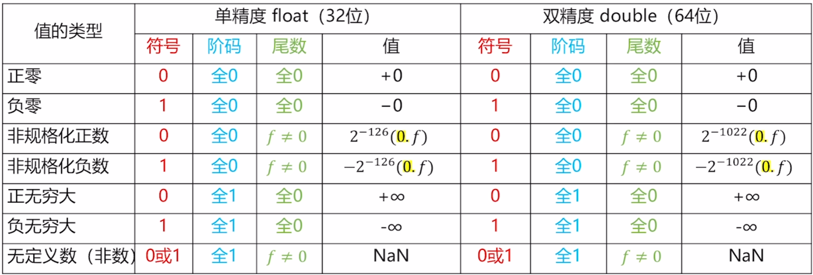
		</div> 
		
		解码全 0 和全 1 留作特殊用途，需要按照特殊方式解读（上图）
	
2. 浮点数的取值范围
	
	<div style="display: flex; align-items: center;">
		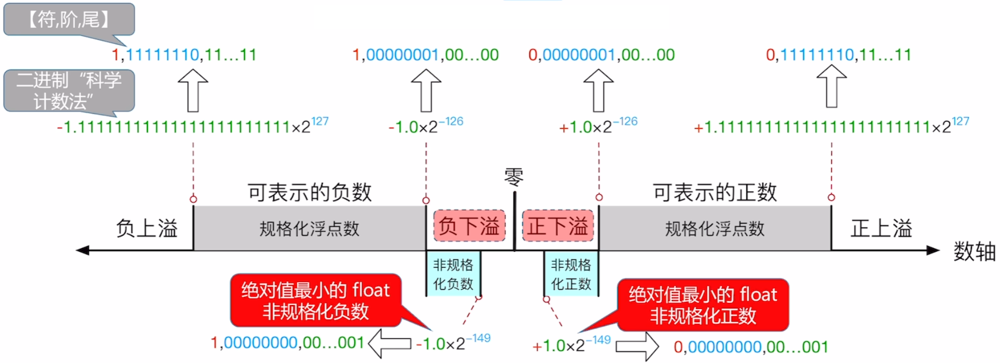
	</div> 
	
3. 超出表示范围的处理
    * 上溢：当运算结果的绝对值大于可表示的最大规格化数时发生。
        1.  将结果设置为 **正无穷** ( $+\infty$ ) 或 **负无穷** ( $-\infty$ )，具体取决于结果的符号。
        2.  设置浮点数 **溢出异常** 标志位。根据 IEEE 754 的默认行为，这通常不会中断程序的执行。
		
    * 下溢：当运算结果的绝对值小于可表示的最小规格化数时发生。
        1.  若结果落在非规格化数的表示区间内，则使用 **非规格化浮点数** 来存储，以尽可能地保留精度。
        2.  若结果比最小的非规格化数还要小（即无限逼近于 $0$ ），则将其 **按机器零存储** (Flush to Zero)。同时，设置浮点数 **下溢异常** 标志位，同样默认不中断程序。
	
4. 无定义数（NaN）
	* 0 除以 0
	* 负数开根号
	* 无穷减无穷
	* 注意： ==非零数除以 0 结果不是无定义数，结果为无穷==（但也会报错）


### 2.3.4 大小端和数据对齐

1.  大小端模式：
	多字节数据（如 $int$ , $float$ 等）在内存中会占据几个连续的字节。==字节序== 定义了这些字节在内存中的排列顺序，主要分为 ==大端== 和 ==小端== 两种模式：
	* 最高有效位（MSB）：一个多字节数据中权重最大的那个字节，或者在一个二进制数中权重最大的那个比特位。类似于十进制数中最左边的数字，它的改变对整个数值的影响最大。
	* 最低有效位（LSB）:一个多字节数据中权重最小的那个字节，或者在一个二进制数中权重最小的那个比特位。类似于十进制数中最右边的数字（个位），它的改变对整个数值的影响最小。
	
	* **大端模式**：将 $MSB$ 存放在内存的最低地址处，而 $LSB$ 存放在最高地址处。这种方式与人类阅读和书写数字的顺序一致，因此便于人类阅读。
    * **小端模式**：将 $LSB$ 数据的存放在内存的最低地址处，而 $MSB$ 则存放在最高地址处。这种模式便于机器进行数值运算。例如，当进行强制类型转换（如从 $4$ 字节的 $int$ 转为 $2$ 字节的 $short$ ）时，小端模式可以直接截取低地址的字节，无需额外调整。目前主流的处理器架构，如Intel x86和多数ARM处理器，都采用小端模式。
    
	<div style="display: flex; align-items: center;">
		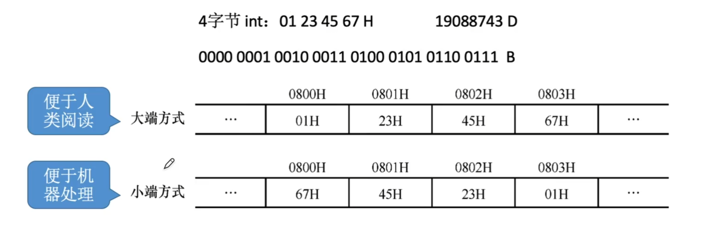
	</div> 

2.  现代计算机通常按字节编址，即每个字节都有一个唯一的内存地址。然而，==CPU访问内存并非逐个字节进行，而是以字长为单位（例如，32 位CPU的字长为 4 字节）==。
	
    <div style="display: flex; align-items: center;">
		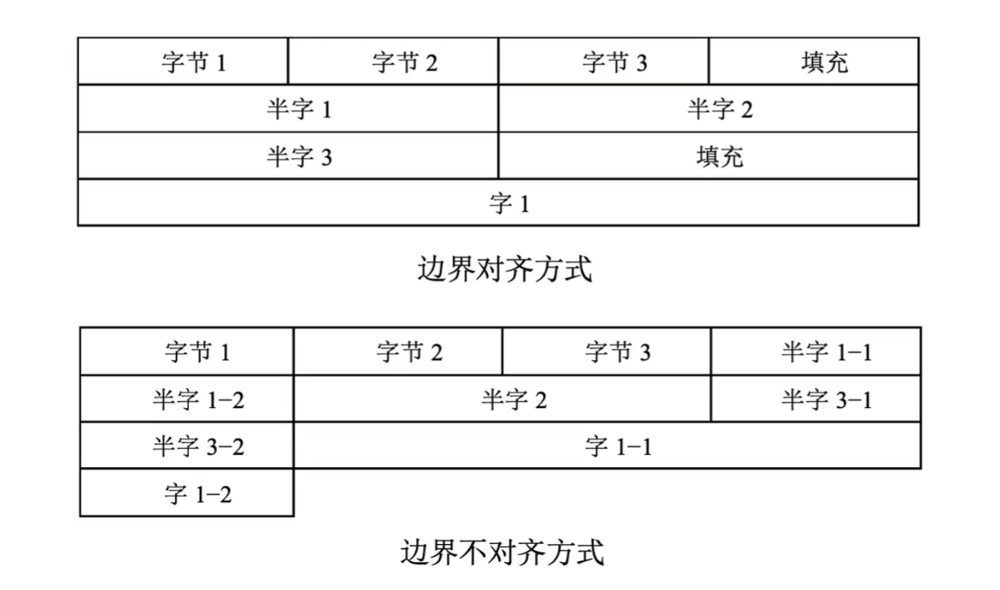
	</div> 
	
    * **边界对齐**：让数据的存放地址与其自身的大小对齐
		读取效率高：CPU每次读取一个4字节的块，都能获得一个或多个完整的数据
		空间浪费：为了对齐而插入的“填充”字节不包含任何有效信息，造成了一定的内存空间浪费
    * **边界不对齐**：数据被紧密地一个挨着一个存放，以节省空间
		节省空间：数据之间没有填充字节，内存利用率更高
		读取效率低：当CPU需要读取一个跨边界的数据（如“半字1”）时，它无法通过一次访问完成


# 3 存储系统

## 3.1 存储器概述

### 3.1.1 存储器分类

1.  **存储系统的层次结构**
    *   存储系统通常分为三个主要层次：
        *   **高速缓存 (Cache):** 速度最快，容量最小（存放 CPU 最常访问的数据，让 CPU 不用每次都去等待慢速的主存）
        *   **主存储器 (主存、内存):** 速度和容量居中，可被 CPU 直接读写（存放当前正在运行的程序和处理的数据）
        *   **辅助存储器 (辅存、外存):** 速度最慢，容量最大（**长期存储** 数据和程序，并解决主存 **容量不足** 的问题）
	
    *   设置层次结构的目的：
        *   **Cache—主存** 层次：主要为了解决 CPU 与主存之间速度不匹配的问题。
        *   **主存—辅存** 层次：主要为了实现虚拟存储系统，从逻辑上扩充主存容量，解决主存容量不足的问题。
	
	* 注意：有的教材把安装在电脑内部的磁盘称为“辅存”，把U盘、光盘等称为“外存”。
			也有的教材把磁盘、U盘、光盘等统称为“辅存”或“外存”
	
	<div style="display: flex; align-items: center;">
		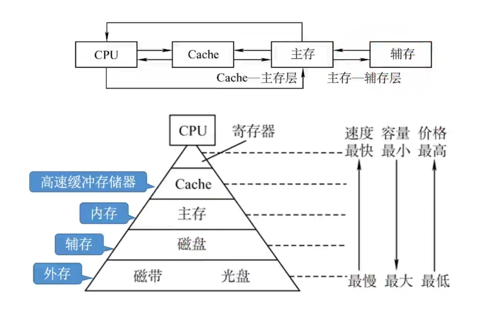
	</div> 
	
2.  **存储器的分类**
    *   **按存储介质：**
        *   半导体存储器：如内存、Cache。
        *   磁表面存储器：如磁盘、磁带。
        *   光存储器：如光盘。
	
    *   **按存取方式：**
        *   **随机存取存储器 (RAM):** 存取时间与物理地址无关（无论是读取存储器中第一个位置的数据，还是最后一个位置的数据，花费的时间几乎是完全相同的）。例如：内存。
        *   **顺序存取存储器 (SAM):** 只能按某种顺序依次存取。例如：磁带。
        *   **直接存取存储器 (DAM):** 介于随机存取和顺序存取之间。例如：磁盘。
        *   **相联存储器 (CAM):** 按内容进行访问。例如：快表 (TLB)。
	
    *   **按信息可更改性：**
        *   读/写存储器。
        *   只读存储器 (ROM)。
	
    *   **断电后信息是否消失 (易失性)：**
        *   **易失性存储器:** 断电后信息会丢失。例如：内存、Cache。
        *   **非易失性存储器:** 断电后信息依然保留。例如：磁盘、光盘。
	
    *   **信息读出后是否被破坏：**
        *   **破坏性读出:** 读出操作会破坏原有信息，需要立即再生。例如：DRAM 芯片。
        *   **非破坏性读出:** 读出操作不会改变原有信息。例如：SRAM 芯片、磁盘。
	
3.  **存储器性能指标**
    *   **存储容量：** 指存储器能存放的二进制代码的总位数。 $存储容量=存储字数\times字长$ 
    *   **单位成本：** 每位信息的平均成本。 $单位成本(每位价格)=\text{总成本 }/\text{ 总容量}$ 
    *   **数据传输率 (主存带宽)：** 表示单位时间内主存与 CPU 之间传送的数据量。 $数据传输率=\text{数据的宽度 }/\text{ 存储周期}$ 
    *   **存取时间 ( $T_a$ )：** 从启动一次存储器操作到完成该操作所需的总时间，分为读出时间和写入时间
    *   **存储周期 ( $T_m$ )：** 连续两次独立的存储器操作（读或写）之间所需的最小时间间隔。 $存储周期=存取时间+恢复时间$ 

![[存储器存储周期.png]]


## 3.2 主存储器

### 3.2.0 主存储器的基本组成

1. 基本元件：主存储器的基本存储单位（存储元）通常由 MOS 管和电容构成
    * **MOS 管**：在电路中起到一个微型电子开关的作用，控制电路的通断（输入电压达到某个阈值时，接通并放出电容中存储的电荷，根据该电荷判断数据是 0 还是 1）
    * **电容**：用于存储电荷。电容中存储电荷的多少可以用来表示二进制的 $0$ 和 $1$ ，从而实现数据存储
	
	
2. **存储芯片的内部结构**
    * **存储矩阵 (存储体)**：由大量存储单元以阵列形式排列而成，是存储芯片的核心。每个存储单元可以存放一个存储字，而每个存储单元又由多个存储元（对应二进制位）构成。
    * **译码驱动电路**：其作用是将来自地址总线的地址信号进行解码，然后驱动对应的字选通线，选中指定的存储单元
		* 地址总线：CPU 通过它告诉存储器要去访问哪个具体位置。地址总线的线数（N根）决定了总共有多少个可选地址（ $2^N$ 个）
		* 译码器：接收地址总线传来的二进制地址，并只激活一根对应的输出线
		* 字选线：被译码器激活的那根线，负责选中存储矩阵中特定的一行存储单元，使其准备好被读写
		CPU 将 **N** 位地址放在**地址总线**上，**译码器**接收后将其翻译，并激活 **$2^N$** 根**字选线**中的唯一一根，从而精确选中目标存储单元
		地址总线的数量 N 是 MAR (存储器地址寄存器) 的位数（宽度）
	
	<div style="display: flex; align-items: center;">
		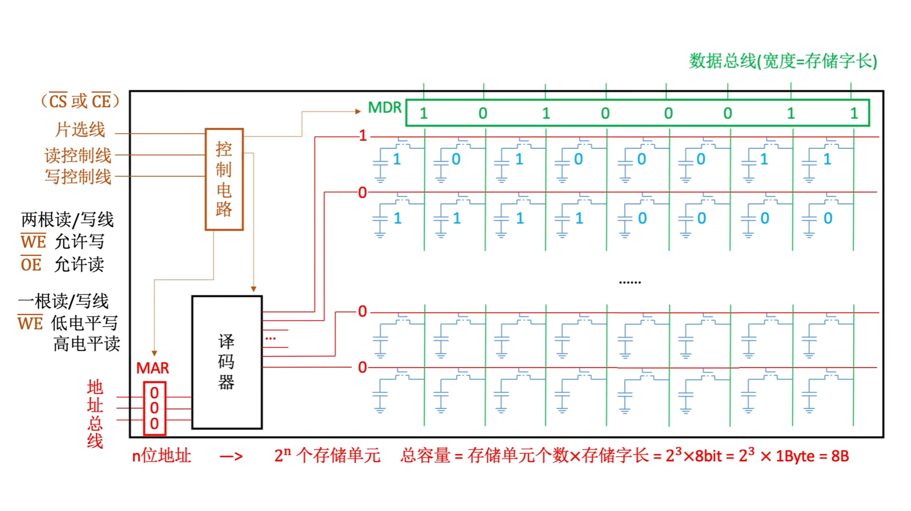
	</div>
	
    * **读写电路**：包含读出放大器和写入电路，负责执行数据的读出和写入操作。每次操作都是针对一个完整的“存储字”
	
    * 芯片通过一系列引脚与外部交互，主要包括：
        * **地址线**：用于接收 CPU 发来的地址信息，以定位存储单元
        * **数据线**：用于在芯片和 CPU 之间双向传输数据
        * **片选线 (CS/CE)**：用于确定当前是否选中该芯片进行操作
        * **读写控制线 (WE/OE)**：用于指定当前操作是“写入”还是“读出”。这两条线有时也可能合并为一条
		
	    常见的对于存储芯片容量的描述：总容量 = 存储单元个数 × 存储字长
	
3.  **主存储器的寻址方式**
    * 现代计算机通常采用**按字节编址**的方式，即存储空间中的每一个字节都拥有一个唯一的地址。
    * 基于字节编址，计算机可以实现多种寻址方式，包括：
        * **按字节寻址**：直接访问单个字节。
        * **按字寻址**：访问一个字（Word），一个字通常由多个字节构成（例如 4 字节或 8 字节）。字的地址是其所包含的字节中地址最小的那个字节的地址。
        * **按半字寻，按双字寻址等**


### 3.2.1 SRAM和DRAM

<div style="display: flex; align-items: center;">
	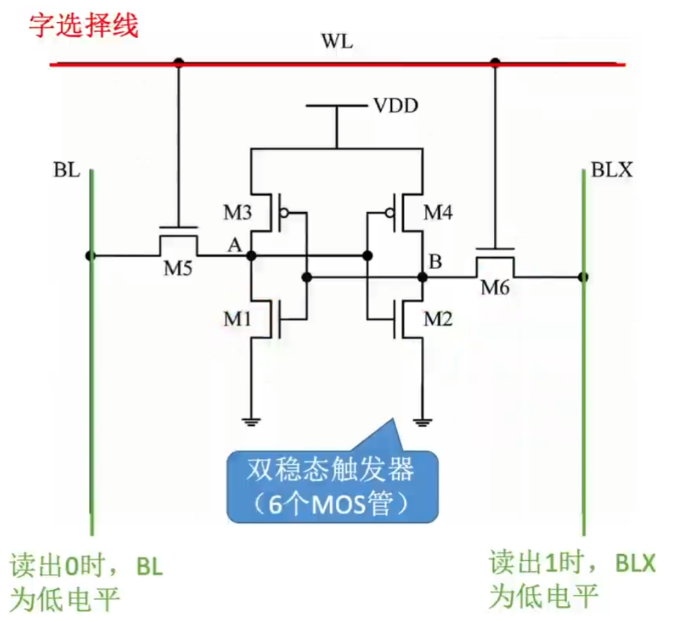
	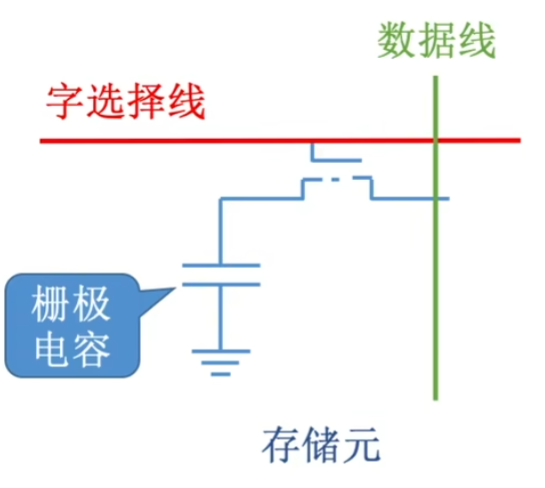
</div>


左图为双稳态触发器（常用于SRAM），右图为栅极电容（常用于DRAM）：

电容每次放电后需要重新充电（存取周期中的恢复时间），故栅极电容运行速度慢，但结构简单，成本低

<div style="display: flex; align-items: center;">
	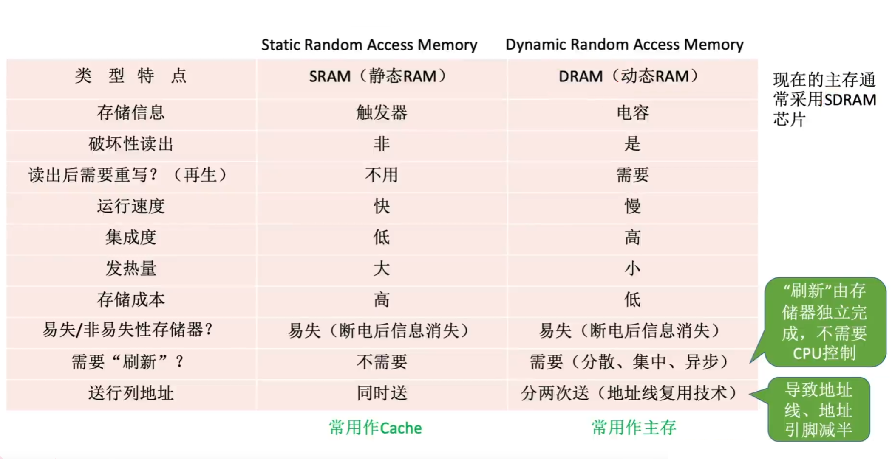
</div> 

关于 DRAM 的相关问题：

1. 行列地址：
	如果一个译码器有 n 位，则我们将有 $2^n$ 个存储单元，所有移码器要连接 $2^n$ 条选通线（实现困难）
	将译码器拆分为行译码器和列译码器，则每个译码器只用处理 $\frac{n}{2}$ 位地址信息，这样每个译码器只用连接 $2^\frac{n}{2}$ 条选通线即可（现在已经出现了三维译码器了）
	每次当一个存储单元被两个移码器选通时，才可以进行读和写

2. 电容中的电荷一般只能存储 2ms，所以每 2ms 要给所有电容重新充电（刷新）
	刷新思路（每次刷新一整行的信息，每次刷新占用 1 个读/写周期（存取周期））：
	* 分散刷新：每次读写都刷新某一行，在 2ms 的时间内我们可以将所有行都刷新多次（一半时间用于读写，一半时间用于刷新）
	* 集中刷新：有一段时间专门用来刷新，且该时间无法访问存储器，称为访问 ==死区==
	* 异步刷新：假设刷新整个芯片需要 n 次，将 n 次刷新均匀的分散在整个 2ms 时间内，平均每段时间刷新一次，且可以在译码阶段刷新（最优）


### 3.2.2 只读存储器 ROM

|  特性   |    ROM (只读存储器)    | RAM (随机存取存储器)  |
| :---: | :---------------: | :------------: |
| 数据易失性 |  非易失性，断电后数据不会丢失   |  易失性，断电后数据会丢失  |
| 数据操作  |     主要用于读取数据      |   可以读取和写入数据    |
|  用途   | 存储永久性的指令，如固件和BIOS | 临时存储正在运行的程序和数据 |
|  速度   |      通常比RAM慢      |    读写速度非常快     |
|  容量   |     容量通常比RAM小     |   容量通常比ROM大    |

*   **MROM (Mask Read-Only Memory)**：掩模式只读存储器
    *   厂家按照客户需求，在芯片生产过程中直接写入信息，之后==任何人不可重写（只能读出）==。
    *   可靠性高、灵活性差、生产周期长、只适合批量定制。

*   **PROM (Programmable Read-Only Memory)**：可编程只读存储器
    *   用户可用专门的PROM写入器写入信息，==写一次之后就不可更改==。

*   **EPROM (Erasable Programmable Read-Only Memory)**：可擦除可编程只读存储器
    *   允许用户写入信息，之后用某种方法擦除数据，==可进行多次重写==。
    *   **UVEPROM (ultraviolet rays):** 用紫外线照射8~20分钟，==擦除所有信息==。
    *   **EEPROM (也常记为E²PROM, 第一个E是Electrically):** 可用“电擦除”的方式，==擦除特定的字==。

*   **Flash Memory**：闪速存储器
    *   注：U盘、SD卡就是闪存。
    *   在EEPROM基础上发展而来，断电后也能保存信息，且==可进行多次快速擦除重写==。
    *   注意：由于闪存需要先擦除再写入，因此==闪存的“写”速度要比“读”速度更慢==。
    *   补充信息1：每个存储元只需单个MOS管，位密度比RAM高。
    *   补充信息2：手机辅存也使用Flash芯片，但相比SSD使用的芯片集成度高、功耗低、价格贵。

*   **SSD (Solid State Drives)**：固态硬盘
    *   由控制单元+存储单元（Flash芯片）构成，与闪速存储器的核心区别在于控制单元不一样，但存储介质都类似，==可进行多次快速擦除重写==。
    *   SSD速度快、功耗低、价格高。目前个人电脑上常用SSD取代传统的机械硬盘。

注意事项：
1. 很多 ROM 也具有随机存取的特性，且虽然名字是“Read-Only”，但很多 ROM 也可以“写”
2. 虽然主存为 RAM，但主板上但依然有 ROM（BIOS 芯片）
	其作用是在电脑开机时（RAM此时为空），从硬盘里找到操作系统，然后把它加载到主存（RAM）中，让计算机启动


### 3.2.3 双端口RAM和多模块存储器

<u>双端口RAM 已经从408大纲移除，但自命题学校可能会考概念</u>

1. 双端口RAM：
	作用：优化多核 CPU 访问同一根内存条的速度
	实现：有两组完全独立的数据线，地址，控制线，且控制电路会更加复杂
	存在类似操作系统中的“读者-写者问题”：
	* 两个端口不能同时写入数据（<font color="#ff0000">写入错误</font>）
	* 两个端口不能一个写入数据，一个读出数据（<font color="#ff0000">读出错误</font>）
	* 两个端口可以同时读出数据
	* 错误解决方法：将其中一个访问延时，另一个正常访问
2. 多体并行存储器
	每个模块都有相同的容量和存取速度，且都有独立的读写控制电路、地址寄存器和数据寄存器，既能并行工作，又能交叉工作。
	
	高位交叉编址：为了“分区”，把大块连续空间划分给不同模块，实现模块化
	低位交叉编址：为了“加速”，把连续数据分散到不同模块，实现并行访问（使得CPU无需再为空闲等待单个存储体的恢复时间，从而极大地提高了数据传输的整体速率）
	下图每一个 M 可视为一个内存条（存储体），
	
	<div style="display: flex; align-items: center;">
		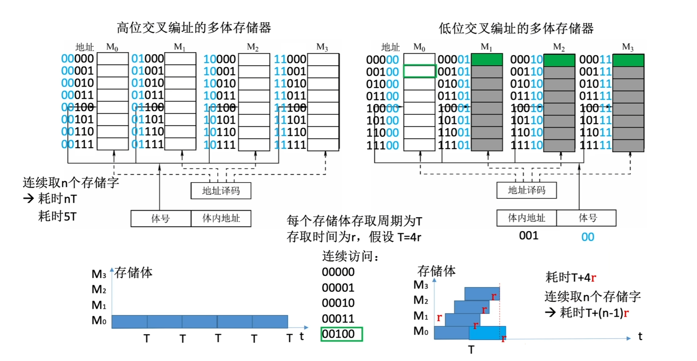
	</div> 
	
	 * 对于低位交叉编址：宏观上一个存储周期内，m 体交叉存储器可以提供的数据量为单个模块的 m 倍（宏观上读写一个字的时间接近 r）
	 * 当存取周期为 T，存取时间或总线传输周期为 r，为了让效率最高，“流水线”不中断，应该保证 $m \ge T/ r$（$m = T/r$ 时最优）
	 * 高位交叉编址，插入多的内存条实现多体并行存储器相当于的扩容
	 * 低位交叉编址，插入多的内存条实现多体并行存储器相当于的“双通道”
	 * 实现双通道为了避免浪费和令效率最高，可以购买两个相同主频和相同容量的内存条
	
	<div style="display: flex; align-items: center;">
		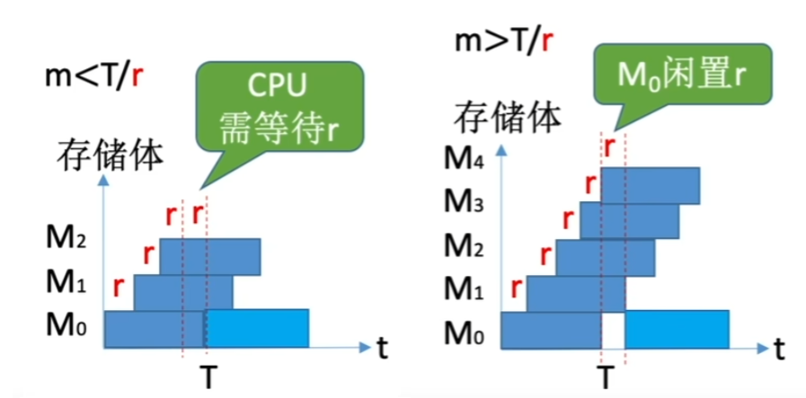
	</div> 
	
3. 单体多字存储体
	每个存储单元存储 m 个字，总线宽度也为 m 个字，一次并行读出 m 个字
	每次只能同时取m个字，不能单独取其中某个字（一次读一行）
	但如果数据不在一行，需要分多次读取


## 3.3 主存储器和CPU连接

1. 主存与CPU的连接
	主存储器需要通过数据总线、地址总线和控制总线与CPU相连，才能在CPU的正确控制下完成读写操作
	存储器芯片的基本结构：半导体存储芯片是构成主存的基础，其内部主要由==译码驱动电路、存储矩阵和读写电路等部分组成==。芯片对外通过==地址线、数据线、片选线和读写控制线==与CPU等其他设备进行通信。
	
	<div style="display: flex; align-items: center;">
		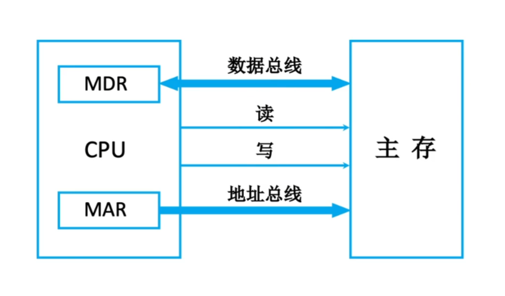
	</div> 
	
2. 位扩展
	指在不改变存储单元数量（地址空间）的情况下，增加每个存储单元的位数（即存储字长），需要有多余的数据总线
	**连接方法**：将所有芯片的地址线、片选线和读写控制线相应并联，而数据线则分别连接到数据总线的不同位上
		每个不同的芯片对应不同的数据总线，那么最终输出相当于所有的芯片中的数据的拼接
	
	<div style="display: flex; align-items: center;">
		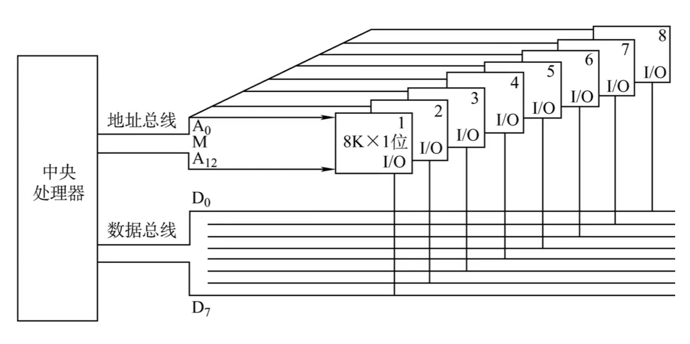
	</div> 
	
3. 字扩展
	指在存储字长不变的情况下，增加存储单元的总数，需要有多余的地址总线（感觉好浪费芯片）
	**连接方法**：将所有芯片的数据线和地址线的低位部分并联，而片选信号则由地址线的高位部分通过译码器产生，用于区分和选择不同的芯片
	* 线选法：用地址总线中未参与片内寻址的某些地址线直接作为各个芯片的片选信号。这种方法简单，但会造成地址空间的不连续和浪费
	* 译码片选法：将地址总线的高位地址线连接到一个译码器，由译码器的输出来选择相应的存储芯片。这种方法可以实现对地址空间的连续、唯一译码
		人话就是，将译码器的选通线输出和选通的芯片输出拼接在一起
		
	<div style="display: flex; align-items: center;">
		
	</div> 
	
4. 字位同时扩展
	当存储芯片的存储单元数和位数都不能满足要求时，需要同时进行字扩展和位扩展。
	可以看作是先进行位扩展，再进行字扩展的组合。首先将芯片分组进行位扩展，以满足所需的字长；然后对这些芯片组进行字扩展，以达到所需的存储容量。
	
	<div style="display: flex; align-items: center;">
		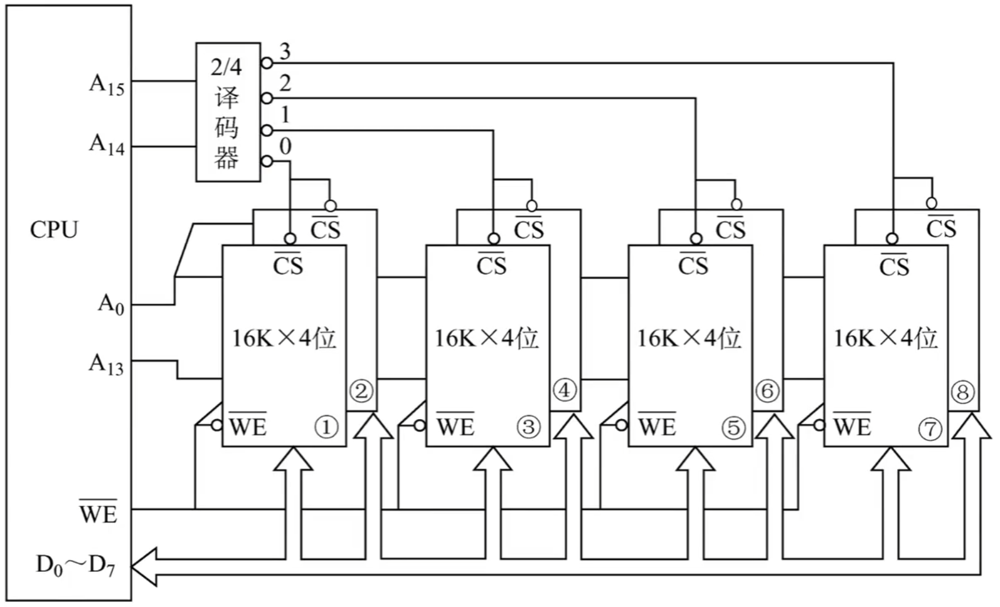
	</div> 

## 3.4 外部存储器

### 3.4.1 磁盘存储器

1. **磁盘原理**
    * **磁盘设备的组成**
        * **存储区域**：物理上，数据存储在 ==盘片== 的 ==磁道== 上，磁道被划分为 ==扇区==，所有盘片上相同半径的磁道共同构成了 ==柱面==（通过磁头感知区域的磁场磁化方向读取数据）
        * **硬盘存储器**：主要由磁盘驱动器、磁盘控制器和盘片组成
        * 注意：
	        每个盘片的正反两面都可以涂上磁性材料用来记录数据，所以磁头数一般是盘片的个数的两倍
	        ==扇区是磁盘读写的最小物理单位==，每个扇区开头会有同步区（扇区开始标志）和地址区（扇区地址），之后才是存放数据的数据区，最后是校验区（检验数据是否损坏）
	
	<div style="display: flex; align-items: center;">
		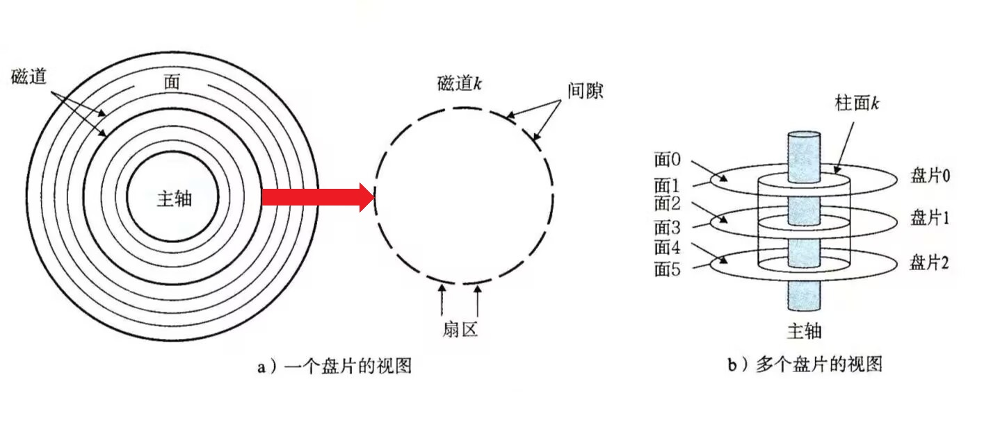
	</div> 
	
    * **性能指标**
        * **容量**：
            * **格式化容量**：指用户可以实际用来存储数据的空间，$格式化容量 = 记录面数 × 柱面数 × 每道扇区数 × 每个扇区的容量$
            * **非格式化容量**：指磁盘的总容量，包含用于存储控制信息等的额外空间，$非格式化容量 = 记录面数 × 柱面数 × 每条磁道的磁化单元数$
        * **记录密度**：
            * **道密度**：沿磁盘半径方向单位长度上的磁道数
            * **位密度**：磁道单位长度上能记录的二进制位数
            * **面密度**：道密度和位密度的乘积
        * **平均存取时间**：磁盘完成一个I/O请求所花费的时间
            * **计算公式为**：$平均存取时间=寻道时间+旋转延迟时间+传输时间$
            * **寻道时间**：磁头移动到目标磁道所需的时间
            * **旋转延迟时间**：等待目标扇区旋转到磁头下方所需的时间（平均延迟时间为旋转半周的时间）
            * **传输时间**：将数据从磁盘读出或写入所需的时间
        * **数据传输率**：单位时间内磁盘传输的数据量，也称为吞吐量
	
    * **磁盘地址**
        * 数据的物理地址由驱动器号、柱面号（磁道号）、盘面号和扇区号共同确定，为==驱动器号（盘符） + 柱面号（磁道号） + 盘面号（磁头号） + 扇区号==
	
2. **磁盘阵列RAID**
    * **思想**：利用磁盘的廉价特点，将多个独立的物理磁盘组成一个独立的逻辑盘，数据在多个物理盘上分割交叉存储、并行访问，具有更好的存储性能、可靠性和安全性
		通过同时使用多个磁盘，提高了传输率
		通过在多个磁盘上并行存取来大幅提高存储系统的数据吞吐量
		通过镜像功能，可以提高安全可靠性
		通过数据校验，可以提供容错能力
		
    * **RAID 0**：
        * 把连续多个数据块交替地存放在不同物理磁盘的扇区中，几个磁盘交叉并行读写，不仅扩大了存储容量，而且提高了磁盘数据存取速度，但RAID0没有容错能力（类似低位交叉编址）
        * **优点**：显著提高存取速度
        * **缺点**：没有容错能力，任何一块磁盘损坏都会导致所有数据丢失
    * **RAID 1**：
        * 提高可靠性，使两个磁盘同时进行读写，互为备份，如果一个磁盘出现故障，可从另一磁盘中读出数据。两个磁盘当一个磁盘使用，意味着容量减少一半
        * **优点**：提供了高的数据冗余和可靠性
        * **缺点**：磁盘利用率只有50%
    * **RAID 2~5**：
        * 通过数据校验（如奇偶校验）来提高容错能力
        * **RAID 5** 是一个典型的例子，它将数据和相应的奇偶校验信息条带化地存储在所有磁盘上，允许一块磁盘发生故障而数据不丢失
	
	<div style="display: flex; align-items: center;">
		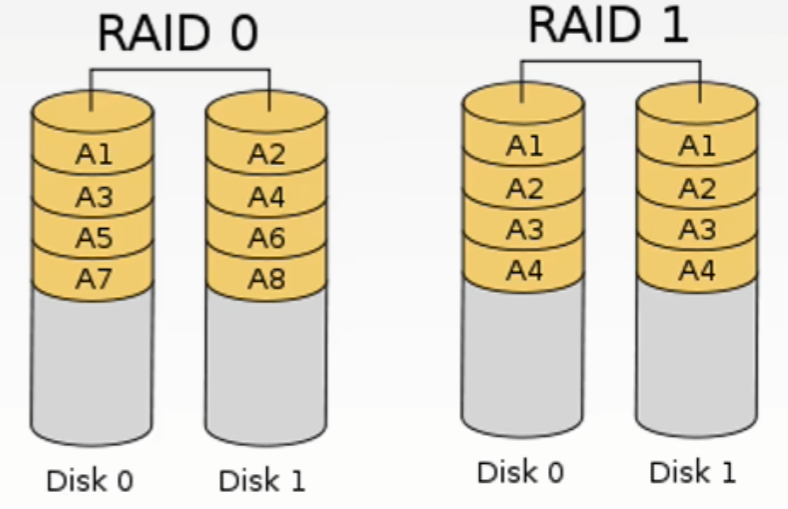
	</div> 


### 3.4.2 固态硬盘

机械硬盘：根据盘面上的磁性物质存储数据

固态硬盘：

1. **原理与构成**
    * **基本原理**：使用闪存技术，属于可以电擦除的 ROM（EEPROM）
    * **核心组成**：
        * **闪存翻译层**：负责将操作系统发来的逻辑块地址翻译成闪存颗粒的物理地址（即对应的页），是SSD主控固件的核心部分。
        * **存储介质**：由多个 **闪存芯片** 构成，是数据的实际载体。
            * 存储结构层次为： 闪存芯片 $\rightarrow$ 块 (Block) $\rightarrow$ 页 (Page)
            * 每个闪存芯片包含多个块，每个块又包含多个页
            * 固态硬盘的一个页相当于机械硬盘的一个扇区，固态硬盘的一个块相当于机械硬盘的一个磁道
	
	<div style="display: flex; align-items: center;">
		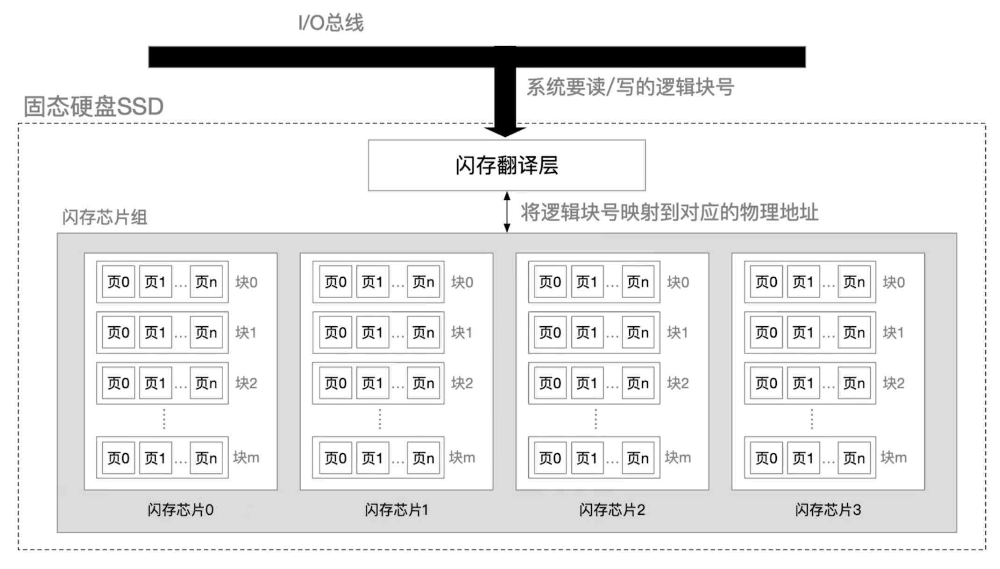
	</div> 
	
2. **读写性能特性**
    * **操作单位**：
        * **以页 (Page) 为单位进行读/写**，==页是读写的最小单元==，其作用相当于机械硬盘的“扇区”
        * **以块 (Block) 为单位进行“擦除”**，==块是擦除的最小单元==。在一个被擦除过的干净块中，其中的每一页都可以写入一次，但可以被无限次读取
    * **读写机制**：
        * **支持随机访问**：当系统给定一个逻辑地址时，闪存翻译层可以通过电路迅速定位到对应的物理地址，没有机械硬盘的寻道和旋转延迟
        * **读快、写慢**：
            * 读取操作速度很快
            * 写入操作相对复杂（如果要写入的页中已经存在数据，则不能直接覆盖写入）
	            控制器需要将该页所在块中的所有有效数据复制到一个新的、已擦除的块中，然后将新数据写入，最后再将原来的块标记为无效，等待后续回收
	
3. **与机械硬盘相比的特点**
    * **性能与访问方式**：SSD读写速度快，随机访问性能极高，通过电路控制直接访问数据位置；而机械硬盘需要通过移动磁臂和旋转磁盘来定位，存在寻道时间和旋转延迟
    * **物理特性**：SSD运行时安静无噪音、耐摔抗震、能耗低
    * **成本与寿命**：
        * 单位容量的造价通常比机械硬盘更贵
        * SSD的一个“块”有擦写次数限制，当被擦除次数过多（频繁重复写入）后可能会损坏。相比之下，机械硬盘的扇区不会因为写入次数过多而损坏
	
4. **磨损均衡技术 (Wear Leveling)**
    * **核心思想**：为了延长SSD的整体使用寿命，将“擦除”操作平均地分布在设备的所有闪存块上
    * **动态磨损均衡**：当有数据写入时，主控会优先选择累计擦除次数较少的新闪存块来使用
    * **静态磨损均衡**：SSD主控会主动监测并自动进行数据分配和迁移。它会将不经常变动的“冷数据”从擦写次数少的块中移到擦写次数较多的块中，从而释放出较新的闪存块来承担更多的写入任务


## 3.5 高数缓冲存储器

### 3.5.1 Cache 基本原理

高速缓冲存储器 (Cache) 是一种小容量但速度极快的存储器，它位于 CPU 和主存之间，用于缓解它们之间的速度矛盾

1. 工作原理：完全由硬件实现，将某些主存块复制到 Cache 中，缓和 CPU 与主存之间的速度矛盾（由于 Cache 的速度接近 CPU，因此可以提高程序的执行速度）
	
2. 局部性原理（Cache 工作的基础）
	* 时间局部性：如果一个数据项被访问，那么在不久的将来它很可能再次被访问
	* 空间局部性：如果一个存储位置被访问，那么其附近的地址也很有可能在不久的将来被访问
	
3. 性能分析
	* 命中与缺失：当 CPU 需要访问数据时，首先在 Cache 中查找。 如果找到了所需的数据，则称为“命中”；如果没有找到，则称为“缺失”
	* 命中率：CPU 访问的信息已在 Cache 中的比率。 命中率 $H$ = 命中次数 / (命中次数 + 缺失次数)
	* 缺失率：CPU 访问的信息不在 Cache 中的比率。 缺失率 $M$ = $1 - H$ 
	* 访问方式：
		* 先访问 Cache：CPU 先访问 Cache，如果未命中，再访问主存
			访问存储系统的平均时间 $T_a$ = $H \times T_{cache} + (1 - H) \times (T_{mem}+T_{cache})$ 
		* 同时访问 Cache 和主存：CPU 同时向 Cache 和主存发出访问请求，若 Cache 命中则立即停止访问主存
			访问存储系统的平均时间 $T_a$ = $H \times T_{cache} + (1 - H) \times T_{mem}$ 
	
4. 其他概念
	* 基于局部性原理，可以将 CPU 目前访问地址所在的块的数据放到 Cache中
	* 将主存的存储空间“分块”，如：每 1KB 为一块。主存与Cache之间以“块”为单位进行数据交换
	* 操作系统中，通常将主存中的“一个块”也称为“一个页/页面/页框”，Cache中的“块”也称为“行”
	
5. Cache分类
	指令Cache（I-Cache）：存放从主存中取出的 ==程序指令==，只读，（顺序执行，更好的空间局部性）
	数据Cache（D-Cache）：存放程序执行过程中需要访问的 ==数据==，可读可写


### 3.5.2 Cache 和主存的映射方式

1. Cache 中存储的块信息，都需要加上有效位 ( 0 和 1，用来判断该块是否填充信息块 )、标记（Tag）
	“标记”用于指明该 Cache 行对应的是哪一个主存块，不同的映射方式，“标记”的位数也不同。
	
2. 全相联映射
	* 映射规则：主存中的任意一个块可以放置到 Cache 中的任意一个位置
	* 主存地址结构：主存地址被划分为两部分：标记 (整个主存块号) 和块内地址
	* 主存地址 = 标记 + 块内地址
		标记位数 = 主存地址总位数 − 主存块位数
	* 优缺点：
		* 优点：Cache 存储空间利用充分，命中率较高，因为映射方式非常灵活
		* 缺点：查找“标记”的速度最慢，因为可能需要与 Cache 中所有行的标记进行比较，导致成本高
	
	<div style="display: flex; align-items: center;">
		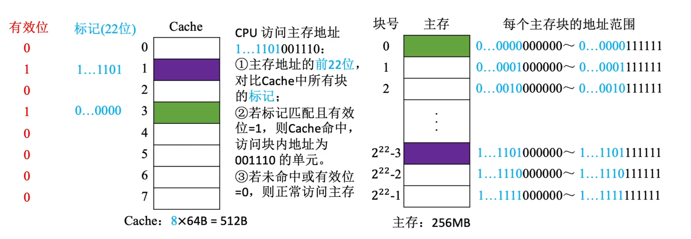
	</div> 
	
3. 直接映射
	* 映射规则：主存中的每一个块只能放置到 Cache 中一个特定的行。 其映射关系通常为 $i = j \pmod{C}$ ，其中 $i$ 为 Cache 行号， $j$ 为主存块号， $C$ 为 Cache 的总行数。
	* 主存地址结构：主存地址被划分为三部分：标记 (主存块号前几位)、行号 (主存块号末几位) 和块内地址。
	* 主存地址 = 标记 + 行号 + 块内地址
	* 优缺点：
		* 优点：对于任意一个地址，只需对比一个“标记”，因此速度最快，硬件实现简单。
		* 缺点：Cache 存储空间利用不充分，容易发生冲突，导致命中率较低。 例如，如果程序需要频繁交替访问两个映射到同一 Cache 行的主存块，就会导致不断的替换，降低效率。
	
	<div style="display: flex; align-items: center;">
		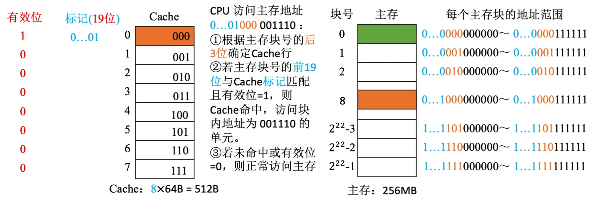
	</div> 
	
4. 组相联映射
	* 映射规则：这是直接映射和全相联映射的一种折中方案。 Cache 被分成若干组，主存中的一个块可以放置到特定分组中的任意一个位置。 
		所属组号的计算方式为 $组号 = 主存块号 \pmod{总组数}$ 
	* 主存地址结构：主存地址被划分为三部分：标记 (主存块号前几位)、组号 (主存块号末几位) 和块内地址
	* 主存地址 = 标记（tag，组内的哪一行） + 组号 + 块内地址
	* 优缺点：
		* 优点：综合了另外两种方式的优点，综合效果较好
		* 术语：$n$ 路组相联映射 (n-way set-associative mapping) 指的是每个 Cache 组包含 $n$ 个 Cache 行
	
	<div style="display: flex; align-items: center;">
		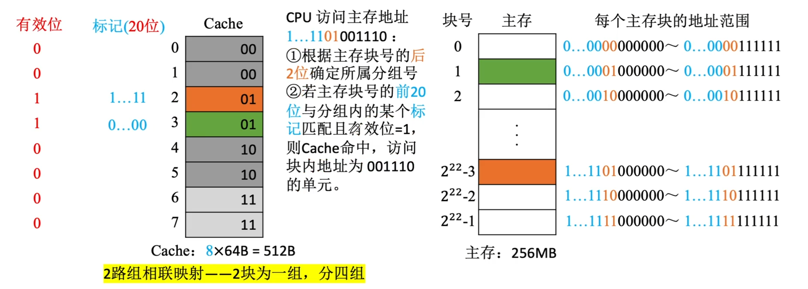
	</div> 


### 3.5.3 Cache 替换算法

1.  随机算法（RAND）：当 Cache 满时，随机选择一个主存块进行替换
	实现简单，但没有利用程序的局部性原理，因此命中率较低，效果很不稳定
	
2.  先进先出算法（FIFO）：优先替换最早被调入 Cache 的主存块，维护一个队列来实现
	同样实现简单，未遵循局部性原理，可能会将频繁访问的块替换出去，导致效率降低，甚至产生“抖动”现象
	
3.  近期最少使用（LRU）：将最久没有被访问过的主存块替换掉
	* 该算法基于“局部性原理”，即近期被访问过的数据很可能在不久的将来再次被访问
	* 淘汰最久未被访问的块是合理的策略，这使得 ==LRU 算法的实际运行效果优秀==，Cache 命中率高
    * 实现方式：通常为每个 Cache 行设置一个“计数器”，用于记录其多久未被访问
	    1. 命中时，所命中的行的计数器清零，比其低的计数器加 $1$ ，其余不变
		2. 未命中且还有空闲行时，新装入的行的计数器置 $0$ ，其余非空闲行全加 $1$
		3. 未命中且无空闲行时，计数值最大的行的信息块被淘汰，新装行的块的计数器置 $0$ ，其余全加 $1$
	    * Cache 块的总数为 $2^n$ ，则计数器只需 $n$ 位（最大的计数器不会超过 $2^n$）
	
5.  最不经常使用（LFU）：将一段时间内被访问次数最少的主存块替换出去（每个 Cache 行需要一个计数器来记录访问频率）
    此算法不能很好地反映近期访问情况，一个过去被频繁访问但在近期不再需要的块，可能长时间占据 Cache 空间，因此实际运行效果不佳


### 3.5.4 Cache 写策略

Cache 写策略是决定 CPU 写操作时如何更新 Cache 和主存数据的规则，主要解决何时与何地写入数据的问题

1. 写命中时（数据在 Cache 里）：当 CPU 对 Cache 写命中时使用
    * 写回法：只修改 Cache 的内容，而不立即写入主存，只有当此块被换出时才写回主存（减少了访问次数，但存在数据不一致的隐患，tag标记位中需增加 1 修改位）
    * 全写法：必须把数据同时写入 Cache 和主存，一般使用写缓存（使用了写缓冲，CPU 写的速度很快，若操作不频繁，则效果好，写操作频繁，会因为写冲饱和而发生阻塞）
	
2. 写未命中时（数据不在 Cache 里）：当 CPU 对 Cache 写不命中时使用
    * 写分配法：把主存中的块调入 Cache，在 Cache 中修改（==搭配写回法==，主存块都不修改）
    * 非写分配法：不调入 Cache，在主存中修改（==搭配全写法使用==，只有“读”未命中时才会调入 Cache，“写”未命中就算在主存中修改后，也不调入 Cache）


拓展：多级 Cache
现代计算机常采用多级 Cache。离 CPU 越近的速度越快，容量越小；离CPU越远的速度越慢，容量越大

<div style="display: flex; align-items: center;">
	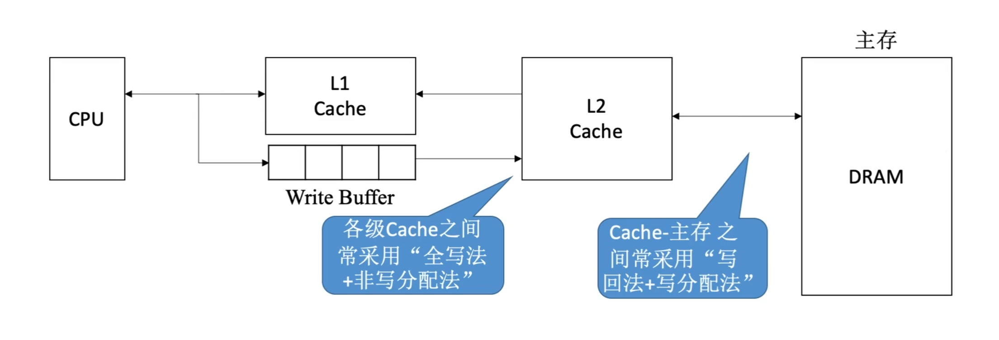
</div> 


# 4 指令系统

## 4.1 指令系统概要

指令系统是指令集体系结构（ISA）中最核心的部分

ISA：
1. 定义了软件和硬件之间的接口
2. 机器语言和汇编语言程序员应该熟悉
3. 规定：
	* 指令格式，指令寻址方式，操作类型
	* 操作数类型和寻址方式
	* 程序可访问的寄存器和存储空间信息
	* 指令执行的控制方式

### 4.1.1 指令的基本格式

<div style="display: flex; align-items: center;">
	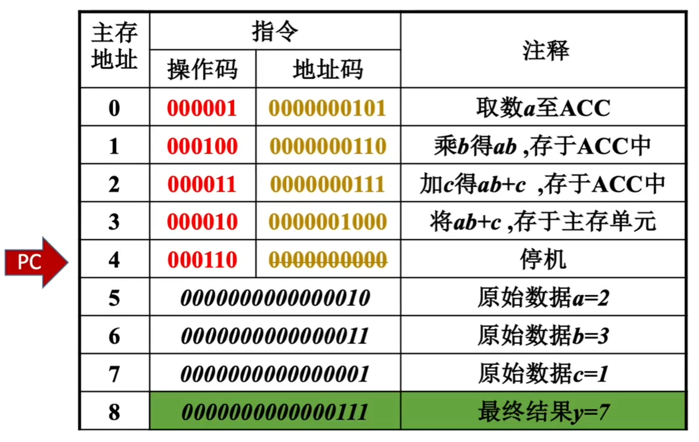
</div> 

指令：计算机能够识别和执行的基本命令，构成计算机程序的最小功能单位（由操作码和地址码构成）
	一台计算机的所有指令的集合构成该机的指令系统，也称为指令集（计算机只能执行自己指令系统中的指令）

操作码（OP）：规定操作性质和功能的部分（做什么）
地址码（A）：指出参与操作的数据所在的位置，或者是操作结果需要存放到哪里去（对谁做）
PC：程序计数器，存放下一条将要执行的指令的内存地址（当一条指令执行时，PC的值会自动更新（通常是增加），以指向序列中的下一条指令）


根据指令中地址码的数量来对指令进行分类：

0. 零地址指令 $OP$
	1. 不需要操作数，如空操作、停机、关中断等指令
	2. 堆栈计算机，两个操作数隐含存放在栈顶和次栈顶，计算结果压回栈顶

1. 一地址指令 $OP + A_1$
	1. 只需要单操作数，如加1、减1、取反、求补等
		指令含义：$OP(A_1)→A_1$，取指令 → 读取 $A_1$ → 写入 $A_1$
	
	2. 需要两个操作数，但其中一个操作数隐含在某个寄存器（如隐含在ACC，累加寄存器）
		指令含义：$(ACC)OP(A_1)→ACC$，取指令 → 读取 $A_1$
	注意：$A_1$ 指某个主存地址，$(A_1)$ 表示 $A_1$ 所指向的地址中的内容

2.  2，3，4地址指令和三地址指令
	常用于需要两个操作数的算术运算、逻辑运算相关指令
	二地址指令：$(A_1)OP(A_2)$ → $A_1$，取指令 → 读出 $A_1$ → 读出 $A_2$ → 写入 $A_1$
	三地址指令：$(A_1)OP(A_2)$ → $A_3$，取指令 → 读出 $A_1$ → 读出 $A_2$ → 写入 $A_3$
	四地址指令：指令操作和三地址指令相同，$A_4$ 表示下一条将要执行指令的地址


### 4.1.2 指令的其他分类

1. 按指令长度分类
	* 指令字长： 一条指令的总长度（可能会变）
	* 机器字长： CPU进行一次整数运算所能处理的二进制数据的位数（通常和ALU直接相关）
	* 存储字长： 一个存储单元中的二进制代码位数（通常和MDR位数相同）
	* 半字长指令、单字长指令、双字长指令 ——指令长度是机器字长的多少倍
	
	指令字长会影响取指令所需时间。如：机器字长=存储字长=16bit，则取一条双字长指令需要两次访存
	* 定长指令字结构： 指令系统中所有指令的长度都相等
	* 变长指令字结构： 指令系统中各种指令的长度不等

2. 按操作码长度分类
	* 定长操作码： 指令系统中所有指令的操作码长度都相同
		* n 位 → $2^n$ 条指令
		* 控制器的译码电路设计简单，但灵活性较低
	
	* 可变长操作码： 指令系统中各指令的操作码长度可变
		* 控制器的译码电路设计复杂，但灵活性较高
	
	* ==定长指令字结构 + 可变长操作码 → 扩展操作码指令格式==

3. 按操作类型分类
	1. 数据传送（进行主存与CPU之间的数据传送）
		* LOAD 作用：把存储器中的数据放到寄存器中
		* STORE 作用：把寄存器中的数据放到存储器中
	
	2. 算术逻辑操作（运算类）
		* 算术：加、减、乘、除、增1、减1、求补、浮点运算、十进制运算
		* 逻辑：与、或、非、异或、位操作、位测试、位清除、位求反
	
	3. 移位操作（运算类）
		* 算术移位、逻辑移位、循环移位(带进位和不带进位)
	
	4. 转移操作（控制类，修改PC，来改变程序执行的顺序）
		* 无条件转移 JMP
		* 条件转移 JZ：结果为0；JO：结果溢出；JC：结果有进位
		* 调用和返回 CALL和RETURN
		* 陷阱(Trap)与陷阱指令
	
	5. 输入输出操作（进行CPU和I/O设备之间的数据传送）
		* CPU寄存器与IO端口之间的数据传送(端口即IO接口中的寄存器)


### 4.1.3 拓展操作码

定长操作码：在指令字的最高位部分分配固定的若干位（定长）表示操作码
* 一般 $n$ 位操作码字段的指令系统最大能够表示 $2^n$ 条指令
* 优：简化硬件，提高速度
* 缺：指令数量增加占用更多固定位，操作码位数受限

扩展操作码：全部指令的操作码字段的位数不固定，且分散地放在指令字的不同位置上
* 最常见的变长操作码方法是扩展操作码，使操作码的长度随地址码的减少而增加
	不同地址数的指令可以具有不同长度的操作码，从而在满足需要的前提下，有效地缩短指令字长
* 优：在指令字长有限的前提下仍保持比较丰富的指令种类
* 缺：译码和分析的难度增加，控制器的设计复杂化

举例：
指令字长为 $16$ 位，每个地址码占 $4$ 位：
前 $4$ 位为基本操作码字段 $OP$，另有 $3$ 个 $4$ 位长的地址字段 $A_1$、$A_2$ 和 $A_1$ 

* $4$ 位基本操作码若全部用于三地址指令，则有 $16$ 条
	但至少须将 `1111` 留作扩展操作码之用，即三地址指令为 $15$ 条；

* `1111 1111` 留作扩展操作码之用，二地址指令为 $15$ 条；

* `1111 1111 1111` 留作扩展操作码之用，一地址指令为 $15$ 条；

* 零地址指令为 $16$ 条

<div style="display: flex; align-items: center;">
	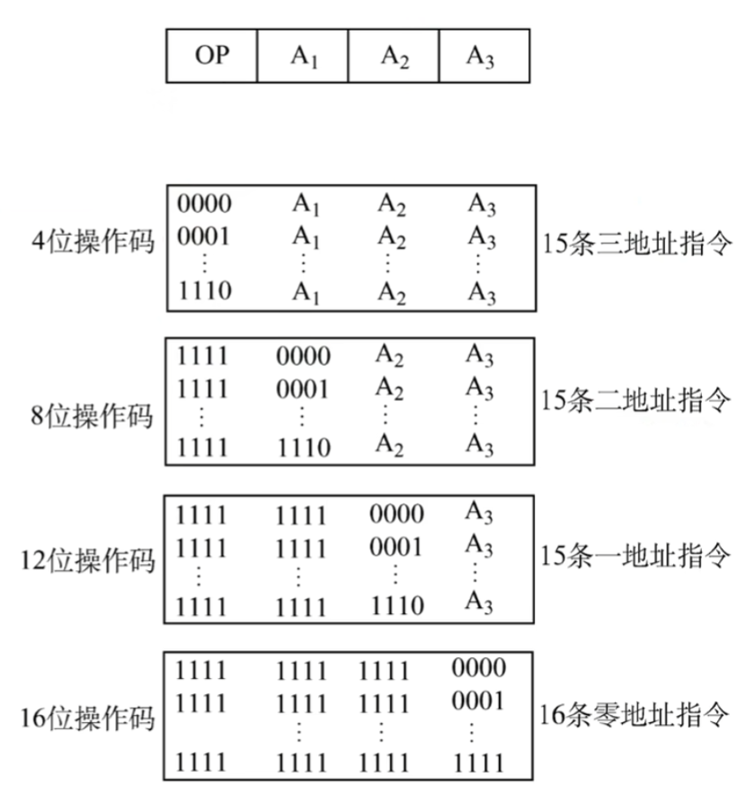
</div> 


在设计扩展操作码指令格式时，必须注意以下两点：
* 不允许短码是长码的前缀，即短操作码不能与长操作码的前面部分的代码相同（没有 `1111` 只有 `1110` 和 `1111 0000`，类似哈夫曼数的“前缀编码”）
* 各指令的操作码一定不能重复

通常情况下，对使用频率较高的指令，分配较短的操作码；对使用频率较低的指令，分配较长的操作码，从而尽可能减少指令译码和分析的时间

关于计算：设地址长度为 $n$，上一层留出 $m$ 种状态（上一层没有用完的操作码个数，包括 `1111` 这种），下一层可扩展出 $m$ × $2^n$ 种状态


## 4.2 指令的寻址方式

### 4.2.1 指令寻址

1.  指令寻址
	确定下一条要执行的指令的存放地址，由程序计数器 PC 来完成
	PC 会存放下一条指令的地址，当一条指令被取出后，PC 的值会自动更新以指向再下一条指令

2.  顺序寻址
    在顺序执行程序时，指令通常是按顺序存放在内存中的
    每次取指令结束后，PC 的值会自动增加一个指令字的长度，指向下一条指令的地址， $(PC) + 1 \rightarrow PC$ 
    此处的“1”应理解为一个指令字长，具体增加的字节数取决于指令长度和内存的编址方式
    注意：==每个指令的长度不一定相同，指令的长度根据指令的操作码来确定==（确定有几个地址码），并根据操作码和地址码的长度和来判断下一个指令的地址

3.  跳跃寻址
	当程序需要改变执行顺序时，会采用跳跃寻址方式
    执行转移类指令（如JMP指令）会导致 PC 值的改变，使其指向新的、非顺序的指令地址
    程序跳转后，会从新的指令地址开始继续顺序执行

4.  指令执行阶段
    每条指令的执行都分为“取指令”和“执行指令”两个阶段
    在取指令阶段确定指令地址，然后获取指令；在执行指令阶段完成指令规定的操作


### 4.2.2 数据寻址

数据选址：确定本条指令的地址码指明的真实地址